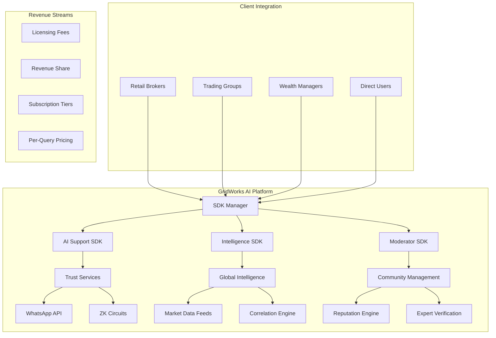

# 🚀 GridWorks Multi-AI SDK Suite - Complete Documentation

> **"The AWS of Trading Intelligence"** - Modular AI services disrupting the entire fintech ecosystem

---

## 🎯 **Executive Summary**

GridWorks Multi-AI SDK Suite provides **three specialized AI services** that can work independently or together, targeting both direct users and enterprise clients with WhatsApp-native delivery:

1. **🛡️ AI Support + WhatsApp + ZK** → Trust-as-a-Service
2. **🌍 Global Morning Pulse** → Intelligence-as-a-Service  
3. **👥 AI Moderator + Expert Verification** → Community-as-a-Service

**Market Disruption**: Transform from competing with trading apps to becoming the **infrastructure they all depend on**.

---

## 🏗️ **Platform Architecture Overview**



---

## 🛡️ **SDK 1: AI Support + WhatsApp + ZK (Trust-as-a-Service)**

### **Core Value Proposition**
Transform customer support from cost center to competitive advantage through AI-powered, ZK-verified, WhatsApp-native support.

### **Key Features**

#### **1. Instant AI Support**
- **GPT-4 Turbo**: Resolves 80% of queries in <30 seconds
- **Multi-language**: 11 Indian languages + English
- **Context-aware**: Integrates with user portfolio, orders, balance
- **Tier-specific**: Different response quality by user tier

#### **2. WhatsApp Native Integration**
- **Voice Notes**: AI-generated voice responses in user's language
- **Rich Media**: Charts, screenshots, interactive buttons
- **Seamless UX**: No app downloads or registrations needed
- **Group Support**: Bulk query handling for trading groups

#### **3. Zero-Knowledge Compliance**
- **Anonymous KYC**: Verify identity without exposing PAN/Aadhaar
- **Audit Trails**: SEBI-compliant logging without privacy breaches
- **Regulatory Shield**: Built-in compliance for all interactions
- **Data Privacy**: Zero data storage, everything ZK-proofed

### **Technical Implementation**

```python
# AI Support SDK Integration
from gridworks_sdk import AISupport, ZKCompliance

class BrokerSupport:
    def __init__(self, broker_config):
        self.support = AISupport(
            api_key=broker_config.api_key,
            channel="whatsapp",
            zk_compliance=True,
            tier_config=broker_config.tier_settings
        )
    
    async def handle_user_query(self, user_id, query, context):
        # ZK-verified user context
        zk_context = await self.support.verify_context(user_id, context)
        
        # AI response generation
        response = await self.support.query(
            user_query=query,
            verified_context=zk_context,
            response_format="whatsapp_voice"
        )
        
        # Compliance logging
        await self.support.log_interaction(
            interaction_id=response.id,
            compliance_proof=response.zk_proof
        )
        
        return response

# Example Response
response = {
    "message": "Your order failed due to insufficient margin by ₹12.50. Would you like me to help you add funds?",
    "voice_note_url": "https://gridworks.ai/voice/xyz123",
    "actions": [
        {"type": "add_funds", "amount": 15, "upi_link": "upi://..."},
        {"type": "retry_order", "order_id": "ABC123"}
    ],
    "zk_proof": "0x...", # Compliance verification
    "response_time": 0.8
}
```

### **Enterprise Integration Patterns**

#### **For Retail Brokers**
```python
# Zerodha/Upstox Integration Example
support_integration = {
    "customer_queries": "80% reduction in human support load",
    "compliance": "Automatic SEBI audit trail generation",
    "user_satisfaction": "Sub-second WhatsApp responses",
    "cost_savings": "₹50L/year in support center costs"
}
```

#### **For Wealth Management Firms**
```python
# HNI Client Support
wealth_config = {
    "tier": "black",
    "features": ["market_butler", "concierge_ai", "portfolio_insights"],
    "sla": "1-second response time",
    "languages": ["english", "hindi", "gujarati"]
}
```

### **Monetization Strategy**

| **Pricing Model** | **Target** | **Rate** | **Volume Discounts** |
|-------------------|------------|----------|----------------------|
| **Per-Query** | Small brokers | ₹0.50/query | 50K+ queries: ₹0.30 |
| **Monthly SaaS** | Mid-size firms | ₹10K-50K/month | Annual: 20% discount |
| **Enterprise License** | Large brokers | ₹5-50L/year | Custom revenue share |
| **ZK Compliance Add-on** | All tiers | +₹5K/month | Regulatory requirement |

---

## 🌍 **SDK 2: Global Morning Pulse (Intelligence-as-a-Service)**

### **Core Value Proposition**
Transform global market noise into actionable India-specific trading intelligence delivered before market open.

### **Key Features**

#### **1. Pre-Market Intelligence (7:30 AM IST)**
- **Global Correlation Analysis**: NASDAQ → TCS, Crude → OMC stocks
- **AI Trade Ideas**: Specific entry/exit points with stop losses
- **Risk Radar**: Fed speeches, geopolitical events impact
- **Institutional Flow Alerts**: FII/DII activity overnight

#### **2. Multi-Format Delivery**
- **Voice Notes**: 30-second AI-generated summaries
- **Text Reports**: Detailed analysis with backtest links
- **WhatsApp Native**: Direct delivery to user's phone
- **Email Integration**: Professional reports for institutions

#### **3. Tier-Based Intelligence**

| **Tier** | **Features** | **Delivery** | **Price** |
|----------|--------------|--------------|-----------|
| **Lite** | Basic global trends | Voice summary | Free (ads) |
| **Pro** | Trade ideas + backtests | Voice + text | ₹499/month |
| **Black** | Institutional flows | All formats + alerts | ₹5K/month |

### **Technical Implementation**

```python
# Global Morning Pulse SDK
from gridworks_sdk import MorningPulse, CorrelationEngine

class IntelligenceService:
    def __init__(self):
        self.pulse_engine = MorningPulse()
        self.correlations = CorrelationEngine()
        
    async def generate_morning_pulse(self, user_tier="pro"):
        # Overnight global market data
        global_data = await self.get_overnight_markets()
        
        # India correlation analysis
        correlations = await self.correlations.analyze_impact(global_data)
        
        # AI trade idea generation
        trade_ideas = await self.generate_trade_ideas(correlations, user_tier)
        
        # Multi-format content creation
        content = await self.create_pulse_content(
            global_triggers=global_data,
            india_impact=correlations,
            trade_ideas=trade_ideas,
            format=["voice", "text"] if user_tier == "pro" else ["voice"]
        )
        
        return content

# Example Morning Pulse Output
morning_pulse = {
    "timestamp": "2025-06-30T07:30:00+05:30",
    "global_triggers": [
        {
            "market": "NASDAQ",
            "change": -1.2,
            "reason": "Nvidia earnings miss",
            "india_impact": "IT stocks risk"
        },
        {
            "commodity": "Brent Crude",
            "change": +3.0,
            "price": 85.0,
            "india_impact": "OMC stocks pressure"
        }
    ],
    "trade_ideas": [
        {
            "action": "SHORT",
            "symbol": "TCS",
            "entry": 3900,
            "stop_loss": 3950,
            "target": 3800,
            "confidence": 0.73,
            "rationale": "NASDAQ correlation + weak guidance"
        }
    ],
    "voice_note": "https://gridworks.ai/pulse/voice/abc123.mp3",
    "risk_alerts": ["Fed speech at 6 PM IST - volatility spike expected"]
}
```

### **Advanced Intelligence Features**

#### **1. Correlation Learning Engine**
```python
# Dynamic correlation detection
correlation_patterns = {
    "NASDAQ_down_1percent": {
        "TCS_impact": -0.8,
        "Infosys_impact": -0.75,
        "confidence": 0.89,
        "historical_accuracy": 0.73
    },
    "Crude_up_5percent": {
        "ONGC_impact": +0.6,
        "IOC_impact": -0.4,  # Refinery margin pressure
        "confidence": 0.92
    }
}
```

#### **2. Institutional Flow Intelligence**
```python
# Black tier exclusive features
institutional_intel = {
    "overnight_flows": {
        "FII_selling": "$200M in futures",
        "DII_buying": "₹1500Cr in cash",
        "net_impact": "Mixed signals - stock specific moves likely"
    },
    "block_deals": [
        {"stock": "RELIANCE", "size": "₹500Cr", "buyer": "LIC"}
    ]
}
```

### **Enterprise Integration Examples**

#### **For TradingView**
```python
# Plugin integration for India users
tradingview_integration = {
    "plugin_name": "GridWorks India Pulse",
    "integration": "Chart overlay with morning pulse insights",
    "monetization": "Revenue share on Pro subscriptions"
}
```

#### **For Wealth Managers**
```python
# Client briefing automation
wealth_integration = {
    "client_reports": "Automated morning briefings for HNI clients",
    "customization": "Firm branding + specific focus areas",
    "white_label": "₹50K setup + ₹10K/month per advisor"
}
```

---

## 👥 **SDK 3: AI Moderator + Expert Verification (Community-as-a-Service)**

### **Core Value Proposition**
Transform chaotic WhatsApp trading groups into professional, monetizable communities with verified experts and AI-driven quality control.

### **Key Features**

#### **1. AI Moderator Bot**
- **Spam Detection**: 99% accuracy in filtering pump-dump schemes
- **Call Tracking**: Automatic logging of buy/sell recommendations
- **Performance Analytics**: Real-time expert accuracy scoring
- **Language Processing**: Multi-language support for regional groups

#### **2. Expert Verification Engine**
- **ZK Credentials**: SEBI registration, track record verification
- **Performance Scoring**: Real-time P&L tracking of calls
- **Tiered Badges**: Bronze/Silver/Gold expert levels
- **Revenue Sharing**: Monetization for verified experts

#### **3. Smart Group Management**
- **Quality Control**: Maximum 50 members per expert group
- **Automated Moderation**: Removes noise, highlights actionable calls
- **Social Proof**: Live follower profitability metrics
- **Cross-Group Intelligence**: Best performing calls shared across network

### **Technical Implementation**

```python
# AI Moderator SDK
from gridworks_sdk import AIModerator, ExpertVerification, GroupAnalytics

class CommunityManager:
    def __init__(self, group_config):
        self.moderator = AIModerator(
            group_id=group_config.group_id,
            zk_reputation=True,
            language=group_config.language
        )
        self.verifier = ExpertVerification()
        
    async def process_group_message(self, message, sender):
        # Spam/quality filtering
        is_valid = await self.moderator.validate_message(message)
        
        if not is_valid:
            await self.moderator.remove_message(message.id)
            return
        
        # Detect trading calls
        trading_call = await self.moderator.extract_trading_call(message)
        
        if trading_call:
            # Log call for tracking
            await self.moderator.log_call(
                expert_id=sender.id,
                call_data=trading_call,
                timestamp=message.timestamp
            )
            
            # Add structured format
            formatted_message = await self.format_trading_call(trading_call)
            await self.moderator.enhance_message(message.id, formatted_message)
        
        return True
    
    async def verify_expert(self, user_id, credentials):
        verification_result = await self.verifier.process_credentials(
            user_id=user_id,
            sebi_id=credentials.get("sebi_id"),
            track_record=credentials.get("pnl_screenshots"),
            references=credentials.get("references")
        )
        
        if verification_result.approved:
            await self.assign_expert_badge(user_id, verification_result.tier)
            await self.setup_monetization(user_id, verification_result.tier)
        
        return verification_result

# Example Expert Verification
expert_profile = {
    "user_id": "expert_789",
    "verification_status": "approved",
    "expert_tier": "gold",
    "credentials": {
        "sebi_registration": "verified",
        "track_record": "73% accuracy over 6 months",
        "specialization": ["derivatives", "swing_trading"],
        "languages": ["english", "hindi", "gujarati"]
    },
    "monetization": {
        "revenue_share": 80, # Expert gets 80%, platform gets 20%
        "subscription_price": 999, # ₹999/month for followers
        "performance_bonus": True
    }
}
```

### **Group Intelligence Features**

#### **1. Smart Call Parser**
```python
# Automatic call structure detection
raw_message = "guys reliance looks good buy around 2500"

parsed_call = {
    "type": "BUY_RECOMMENDATION",
    "symbol": "RELIANCE",
    "action": "BUY",
    "price": 2500,
    "confidence": "medium", # Based on language analysis
    "missing_fields": ["stop_loss", "target", "timeframe"],
    "expert_score": 0.73, # Historical accuracy
    "formatted_output": """
🎯 TRADING CALL DETECTED
📈 RELIANCE - BUY around ₹2500
👤 Expert: @TradingGuru (73% accuracy)
⚠️ Missing: Stop Loss, Target
📊 Followers' avg profit this month: +₹2.3L
    """
}
```

#### **2. Performance Dashboard**
```python
# Real-time group analytics
group_performance = {
    "group_id": "nifty_futures_pro",
    "expert": {
        "name": "Expert Raj",
        "current_month": {
            "calls_made": 12,
            "profitable_calls": 9,
            "accuracy": 75,
            "avg_return": 8.3,
            "followers_profit": 234000 # Total profit in ₹
        }
    },
    "top_performers": [
        {"call": "SHORT NIFTY 19200", "return": 3.2, "followers": 45},
        {"call": "BUY HDFC 1650", "return": 2.8, "followers": 38}
    ]
}
```

### **Revenue Model for Community Management**

| **Service Level** | **Group Size** | **Monthly Fee** | **Expert Revenue Share** |
|-------------------|----------------|-----------------|-------------------------|
| **Basic Moderation** | Up to 100 | ₹500/month | N/A |
| **Expert Group** | Up to 50 | ₹2999/month | 80% to expert |
| **Elite Circle** | Up to 25 | ₹9999/month | 85% to expert |
| **1:1 Advisory** | Individual | ₹25K/month | 90% to expert |

### **Viral Growth Mechanisms**

#### **1. FOMO Group Invites**
```python
# Scarcity-driven growth
invite_system = {
    "group_status": "49/50 members",
    "waitlist": 127,
    "last_spot_timer": "2 hours remaining",
    "social_proof": "Members made avg ₹45K profit this month"
}
```

#### **2. Cross-Group Success Broadcasting**
```python
# Network effect amplification
success_amplification = {
    "trigger": "Member books 15% profit",
    "action": "Broadcast to connected groups",
    "message": "🚀 Breaking: Member from our network just booked 15% on TATA Motors call",
    "cta": "Join our sister group for similar opportunities"
}
```

---

## 🔧 **Unified SDK Integration Framework**

### **SDK Manager Architecture**
```python
# GridWorks SDK Manager
from gridworks_sdk import GridWorksSDK

class TradingPlatformIntegration:
    def __init__(self, platform_config):
        self.sdk = GridWorksSDK(
            api_key=platform_config.api_key,
            services=["support", "intelligence", "moderator"],
            whatsapp_config=platform_config.whatsapp,
            zk_config=platform_config.zk_settings
        )
    
    async def initialize_services(self):
        # Support service for customer queries
        self.support = await self.sdk.init_support_service(
            tier_configs=self.platform_tier_mapping,
            compliance_mode="sebi_compliant"
        )
        
        # Intelligence service for market insights
        self.intelligence = await self.sdk.init_intelligence_service(
            data_sources=["global_markets", "institutional_flows"],
            delivery_channels=["whatsapp", "email"]
        )
        
        # Moderator service for community management
        self.moderator = await self.sdk.init_moderator_service(
            group_management=True,
            expert_verification=True
        )
    
    async def unified_user_experience(self, user_id, request_type, data):
        """Single entry point for all AI services"""
        
        if request_type == "support_query":
            return await self.support.handle_query(user_id, data)
        
        elif request_type == "morning_pulse":
            return await self.intelligence.get_morning_pulse(user_id)
        
        elif request_type == "group_message":
            return await self.moderator.process_message(data)
        
        else:
            return {"error": "Unknown request type"}

# Enterprise Integration Example
broker_integration = TradingPlatformIntegration(
    platform_config={
        "api_key": "broker_xyz_key",
        "whatsapp": {"business_account_id": "...", "access_token": "..."},
        "zk_settings": {"compliance_level": "sebi", "audit_retention": "7_years"}
    }
)
```

---

## 💰 **Comprehensive Monetization Strategy**

### **Revenue Streams Matrix**

| **Client Type** | **SDK Bundle** | **Pricing Model** | **Annual Revenue Potential** |
|-----------------|----------------|-------------------|----------------------------|
| **Small Brokers** | Support + Intelligence | ₹50K-2L/year | ₹10Cr (500 clients) |
| **Large Brokers** | Full Suite + White Label | ₹5-50L/year | ₹100Cr (20 clients) |
| **Trading Groups** | Moderator + Verification | ₹1K-10K/month | ₹50Cr (Revenue share) |
| **Wealth Managers** | Intelligence + Support | ₹2-20L/year | ₹30Cr (150 clients) |
| **TradingView/International** | API Licensing | $10K-100K/year | ₹25Cr (Global expansion) |

### **Revenue Share Models**

#### **Expert Monetization (Community SDK)**
```python
revenue_sharing = {
    "expert_earnings": {
        "gold_expert": "₹50K-5L/month (1000+ followers)",
        "silver_expert": "₹20K-2L/month (500+ followers)",
        "bronze_expert": "₹5K-50K/month (100+ followers)"
    },
    "platform_take": "15-20% of subscription revenue",
    "incentives": {
        "accuracy_bonus": "5% extra for >80% accuracy",
        "retention_bonus": "3% extra for >90% retention"
    }
}
```

#### **Broker Integration Revenue**
```python
broker_revenue_models = {
    "usage_based": "₹0.30-0.50 per support query",
    "saas_monthly": "₹10K-50K per month fixed",
    "enterprise_annual": "₹5L-50L per year + success fee",
    "revenue_share": "10-15% of increased user engagement"
}
```

---

## 🎯 **Go-to-Market Strategy**

### **Phase 1: Foundation (Months 1-3)**
1. **Pilot with 5 partners** (2 brokers + 3 trading groups)
2. **Prove metrics**: 80% query resolution, 70% accuracy in calls
3. **Build case studies**: Cost savings and engagement improvements

### **Phase 2: Scale (Months 4-9)**
1. **Target 50 broker partnerships**
2. **Launch expert verification program** (100 verified experts)
3. **International expansion** (Southeast Asia markets)

### **Phase 3: Dominance (Months 10-18)**
1. **Enterprise white-label** solutions
2. **API marketplace** for third-party developers
3. **Regulatory product** (automated compliance reporting)

### **Success Metrics**

| **Metric** | **Target (Year 1)** | **Measurement** |
|------------|---------------------|-----------------|
| **API Calls** | 10M+ monthly | Query volume across all SDKs |
| **Expert Network** | 1000+ verified experts | Community SDK adoption |
| **Enterprise Clients** | 100+ paying clients | B2B revenue diversification |
| **User Engagement** | 80%+ daily active | WhatsApp delivery effectiveness |
| **Revenue** | ₹50Cr ARR | Multi-stream revenue validation |

---

## 🔮 **Competitive Moats & Defensibility**

### **Technical Moats**
1. **Correlation Intelligence**: Proprietary global-to-India market correlation models
2. **ZK Infrastructure**: Privacy-preserving compliance technology
3. **Multi-language AI**: Native Indian language processing for trading
4. **WhatsApp Expertise**: Deep integration with Business API

### **Data Moats**
1. **Expert Performance Database**: Real-time tracking of 1000+ experts
2. **Community Behavior**: Group dynamics and engagement patterns
3. **Market Correlation**: Proprietary dataset of global market impacts
4. **User Interaction**: Millions of support queries and resolutions

### **Network Effects**
1. **Expert Ecosystem**: More experts → better content → more users
2. **Broker Partnerships**: More brokers → more data → better AI
3. **Community Cross-pollination**: Groups share insights across network
4. **Enterprise Integration**: More clients → more customization → stronger moats

---

## 🚀 **Implementation Roadmap**

### **Technical Implementation Priority**

| **Priority** | **Component** | **Timeline** | **Resources** |
|--------------|---------------|--------------|---------------|
| **P0** | AI Support SDK Enhancement | 2 weeks | Existing codebase extension |
| **P0** | Global Morning Pulse Engine | 3 weeks | New intelligence service |
| **P0** | AI Moderator Core | 3 weeks | New community service |
| **P1** | Expert Verification System | 2 weeks | ZK integration |
| **P1** | Unified SDK Manager | 1 week | Integration framework |
| **P2** | Partner Portal Integration | 2 weeks | Dashboard and documentation |
| **P2** | Enterprise APIs | 2 weeks | White-label customization |

### **Business Development Priority**

| **Priority** | **Target** | **Timeline** | **Outcome** |
|--------------|------------|--------------|-------------|
| **P0** | 2 pilot brokers | Month 1 | Proof of concept |
| **P0** | 5 trading group moderators | Month 1 | Community validation |
| **P1** | TradingView partnership discussion | Month 2 | International expansion |
| **P1** | SEBI compliance certification | Month 3 | Regulatory approval |
| **P2** | 20 broker pipeline | Month 6 | Scale validation |

---

## 🏆 **Why This Strategy Wins**

### **1. Platform Play vs Product Play**
- **Traditional**: Build better trading app
- **GridWorks**: Become infrastructure for all trading apps

### **2. Multiple Revenue Streams**
- **Traditional**: Single subscription model
- **GridWorks**: Licensing + Revenue share + SaaS + Enterprise

### **3. Network Effects**
- **Traditional**: Linear user growth
- **GridWorks**: Exponential growth through expert ecosystem

### **4. Regulatory Advantage**
- **Traditional**: Compliance as cost
- **GridWorks**: Compliance as service (ZK-as-a-Service)

---

## 💡 **Final Strategic Insight**

**"We're not just disrupting WhatsApp trading groups or broker support - we're creating the nervous system of Indian financial markets."**

Every query, every expert call, every market insight flows through GridWorks infrastructure. This positions us as:

1. **Too critical to displace** (infrastructure dependency)
2. **Too valuable to bypass** (network effects)
3. **Too compliant to regulate** (ZK-privacy + SEBI alignment)

**This isn't just a fintech company - it's the AWS of financial intelligence.**

---

*Documentation completed: June 30, 2025*  
*Version: 1.0 - Multi-AI SDK Suite*  
*Status: Ready for implementation and enterprise partnerships*