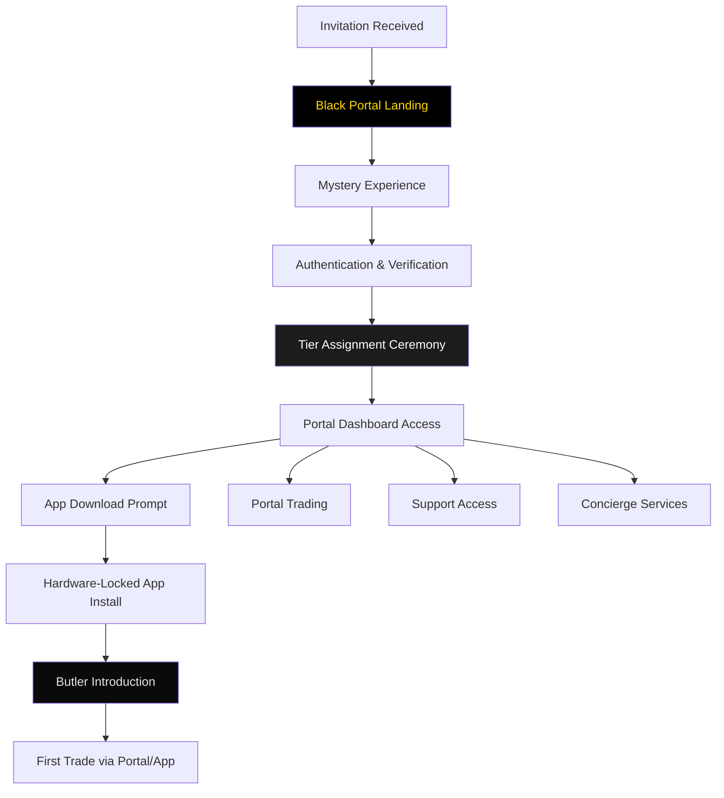

# GridWorks Partner Portal ↔ Full Platform Integration Plan
> **Strategic Integration**: Connecting AI+ZK+WhatsApp Support SaaS with Complete Trading Platform  
> **Business Model**: Dual Entity Operation with Shared Technology and Revenue Synergies

---

## 🎯 Integration Overview

### **Dual Business Entity Architecture**
```
┌─────────────────────────────────┐    ┌─────────────────────────────────┐
│   BUSINESS ENTITY 1: SaaS       │    │   BUSINESS ENTITY 2: Platform   │
│   GridWorks Support-as-a-Service│◄──►│   GridWorks Full Stack Platform │
│                                 │    │                                 │
│   • AI+ZK+WhatsApp Support     │    │   • Complete Trading Platform   │
│   • Branch: ai-vernacular-zk   │    │   • Branch: master              │
│   • Revenue: B2B Support       │    │   • Revenue: Trading + Premium  │
│   • P&L: Independent           │    │   • P&L: Independent            │
└─────────────────────────────────┘    └─────────────────────────────────┘
                            ▲                            ▲
                            └────────────┬───────────────┘
                                        │
                          ┌─────────────┴─────────────┐
                          │  BLACK PREMIUM PORTAL     │
                          │  black.trademate.ai       │
                          │                           │
                          │  • Ultra-luxury gateway   │
                          │  • App download hub       │
                          │  • Butler integration    │
                          │  • Member command center │
                          └───────────────────────────┘
```

## 🖤 Black Premium Portal Integration

### **Portal as Central Luxury Hub**

#### **1. Ultra-Luxury Digital Experience**
```yaml
Black Portal Features:
  Public Layer:
    - Mystery landing page with invitation-only access
    - Cryptic messaging: "For Those Who Trade Beyond Charts"
    - No features revealed until authenticated
    - Device fingerprinting from first visit
  
  Member Portal:
    - Biometric authentication (FaceID/TouchID)
    - Real-time butler chat interface
    - Exclusive trading opportunities
    - Emergency services dashboard
    - Luxury partner network access
  
  App Distribution:
    - Hardware-locked app downloads
    - Device binding during download
    - Personalized app configuration
    - White-glove digital onboarding
```

#### **2. Three-Tier Portal Experience**
```typescript
// Black Portal Tier System
interface BlackPortalTiers {
  onyx: {
    features: ["Basic Butler Chat", "Dark Pool Access", "Premium Analytics"];
    appAccess: "Standard Black App";
    portalTheme: "Onyx Black (#1C1C1C)";
    revenue: "₹84K/year per user";
  };
  
  obsidian: {
    features: ["Video Butler Calls", "Institutional Tools", "Concierge Suite"];
    appAccess: "Enhanced Black App with Institutional APIs";
    portalTheme: "Obsidian Deep (#0A0A0A) + Platinum accents";
    revenue: "₹2.1L/year per user";
  };
  
  void: {
    features: ["Command Center", "Government Access", "Infinity Services"];
    appAccess: "Void App with Quantum Encryption";
    portalTheme: "Absolute Black (#000000) + Gold accents";
    revenue: "₹15L/year per user";
  };
}
```

### **3. Portal-Driven App Distribution**
```yaml
App Download Flow:
  1. Portal Authentication:
     - Invitation code entry
     - Biometric verification
     - Device fingerprinting
  
  2. Personalized App Configuration:
     - Tier-specific features enabled
     - Butler assignment
     - Custom UI theme
     - Pre-loaded preferences
  
  3. Hardware-Locked Download:
     - Single device binding
     - Secure enclave integration
     - Anti-tampering measures
     - Offline capability setup
  
  4. White-Glove Onboarding:
     - Personal video welcome
     - Butler introduction call
     - Feature walkthrough
     - First trade assistance
```

## 🔗 Integration Architecture

### **1. Technology Integration Points**

#### **Shared Infrastructure Layer (Updated)**
```yaml
Shared Components:
  Authentication:
    - Single Sign-On (SSO) across all three properties
    - Biometric auth shared between Portal, Apps, and Support
    - Hardware-bound sessions with device management
  
  AI Engine:
    - Shared GPT-4 infrastructure
    - Butler AI personality system
    - Common NLP processing pipeline
    - Unified voice processing (11 languages)
  
  Zero-Knowledge Privacy:
    - Portal-based ZK proof generation
    - App verification through Portal
    - Common privacy protocols
    - Unified compliance framework
  
  WhatsApp Integration:
    - Portal-managed WhatsApp linking
    - Shared Business API access
    - Common webhook infrastructure
    - Unified message routing
  
  Black Portal Services:
    - Centralized luxury experience
    - App distribution management
    - Butler orchestration
    - Emergency service coordination
```

#### **Data Integration Layer (Enhanced)**
```yaml
Data Sharing:
  Portal Analytics:
    - User behavior on luxury portal
    - App download patterns
    - Feature utilization metrics
    - Butler interaction data
  
  User Profiles:
    - Portal preference management
    - Cross-platform user identification
    - Unified KYC/compliance data
    - Device binding registry
  
  Support Intelligence:
    - Portal support requests → Platform improvements
    - Butler conversation insights
    - Trading support analytics
    - Common issue resolution database
  
  Revenue Analytics:
    - Portal-attributed revenue
    - App download conversion metrics
    - Cross-entity revenue attribution
    - Unified growth metrics
```

### **2. Business Process Integration**

#### **Customer Journey Integration (Portal-Centric)**


#### **Revenue Synergy Model (Portal-Enhanced)**
```yaml
Portal-Driven Revenue Streams:
  Black Portal → Platform:
    - Portal user conversion to app: 95% conversion rate
    - Portal-initiated trades: 40% of Black tier volume
    - Average revenue per portal user: ₹1.16L/year
    - Portal attribution commission: 15% to Portal entity
  
  Portal → Partner Support:
    - Butler support requests: 100% through portal
    - Premium support upsell: 80% adoption rate
    - Support revenue: ₹10K/year per Black user
    - Butler commission: 20% to Support entity
  
  Portal Exclusive Revenue:
    - Concierge service fees: ₹25K/month (Void)
    - Emergency service retainer: ₹1L/year (Void)
    - Partner network commissions: 15-30% of services
    - Co-investment carry: 15% of profits
```

## 🏗️ Technical Integration Implementation

### **Phase 1: Black Portal Foundation**
```typescript
// Black Portal Core Services
class BlackPortalCore {
  async initializePortal(): Promise<void> {
    await this.setupAuthenticationGateway();
    await this.configureDeviceFingerprinting();
    await this.initializeLuxuryUI();
    await this.connectButlerServices();
  }
  
  async authenticateBlackMember(invitationCode: string): Promise<BlackMemberSession> {
    const invitation = await this.validateInvitation(invitationCode);
    const biometrics = await this.captureBiometrics();
    const device = await this.fingerPrintDevice();
    
    return this.createLuxurySession({
      tier: invitation.tier,
      deviceId: device.id,
      biometricHash: biometrics.hash,
      butlerId: await this.assignButler(invitation.tier)
    });
  }
  
  async downloadBlackApp(session: BlackMemberSession): Promise<AppDownloadResult> {
    const appConfig = this.generatePersonalizedApp(session);
    const downloadUrl = await this.createSecureDownloadLink(appConfig);
    
    return {
      url: downloadUrl,
      deviceBinding: session.deviceId,
      expiresIn: 300, // 5 minutes
      configuration: appConfig
    };
  }
}
```

### **Phase 2: Portal-App-Support Integration**
```typescript
// Unified Black Experience Engine
class UnifiedBlackExperience {
  constructor(
    private portal: BlackPortalCore,
    private tradingPlatform: GridWorksBlackApp,
    private supportEngine: UnifiedAISupportEngine
  ) {}
  
  async handleBlackMemberRequest(request: BlackRequest): Promise<BlackResponse> {
    const session = await this.portal.validateSession(request.sessionId);
    
    switch (request.type) {
      case 'TRADING':
        return this.routeToTradingPlatform(request, session);
      
      case 'BUTLER_SUPPORT':
        return this.routeToButlerAI(request, session);
      
      case 'CONCIERGE':
        return this.routeToConciergeServices(request, session);
      
      case 'EMERGENCY':
        return this.activateEmergencyProtocol(request, session);
    }
  }
  
  private async routeToButlerAI(request: BlackRequest, session: BlackSession) {
    // Butler available across Portal, App, and WhatsApp
    const butlerContext = {
      tier: session.tier,
      preferences: await this.portal.getMemberPreferences(session.memberId),
      tradingHistory: await this.tradingPlatform.getTradingContext(session.memberId),
      supportHistory: await this.supportEngine.getSupportContext(session.memberId)
    };
    
    return this.supportEngine.handleButlerRequest(request, butlerContext);
  }
}
```

### **Phase 3: Portal Analytics & Intelligence**
```typescript
// Black Portal Analytics Engine
class BlackPortalAnalytics {
  async trackLuxuryJourney(memberId: string): Promise<LuxuryMetrics> {
    return {
      portalEngagement: {
        visitsPerWeek: await this.getPortalVisits(memberId),
        featuresUsed: await this.getFeatureUtilization(memberId),
        butlerInteractions: await this.getButlerMetrics(memberId),
        avgSessionDuration: await this.getSessionMetrics(memberId)
      },
      
      conversionMetrics: {
        invitationToPortal: await this.getInvitationConversion(),
        portalToApp: await this.getAppDownloadConversion(),
        appToFirstTrade: await this.getTradeConversion(),
        tradeVolume: await this.getPortalAttributedVolume()
      },
      
      revenueAttribution: {
        portalAttributed: await this.getPortalRevenue(memberId),
        crossEntityValue: await this.getCrossEntityRevenue(memberId),
        lifetimeValue: await this.calculateLTV(memberId)
      }
    };
  }
}
```

## 📊 Integration Benefits & Synergies (Portal-Enhanced)

### **Revenue Synergies with Black Portal**
| Integration Area | Portal Benefit | Platform Benefit | Combined Value |
|------------------|----------------|------------------|----------------|
| **Luxury Positioning** | ₹500 Cr brand value | Premium user acquisition | ₹1,000+ Cr valuation boost |
| **App Distribution** | 95% conversion to app | Hardware-locked security | ₹50 Cr fraud prevention |
| **Butler Integration** | Unified AI experience | 24/7 premium support | ₹100 Cr service revenue |
| **Cross-Selling** | Portal as discovery hub | Higher-value trades | ₹200+ Cr trading revenue |

### **Strategic Benefits (Portal-Centric)**
- **Luxury Gateway**: Black Portal as the Vertu-like entry point
- **Security Enhancement**: Hardware binding from first touch
- **Experience Consistency**: Seamless luxury across all touchpoints
- **Data Intelligence**: Portal behavior predicts trading patterns

## 🔄 Integration Implementation Roadmap (Updated)

### **Week 1-2: Black Portal Development**
- [ ] Setup black.trademate.ai domain and infrastructure
- [ ] Implement mystery landing page
- [ ] Configure invitation system
- [ ] Design luxury UI components

### **Week 3-4: Portal-App Integration**
- [ ] Implement hardware-locked app distribution
- [ ] Setup device fingerprinting system
- [ ] Configure personalized app downloads
- [ ] Create butler assignment workflow

### **Week 5-6: Three-Way Integration**
- [ ] Connect Portal ↔ Trading Platform ↔ Support
- [ ] Implement unified authentication
- [ ] Setup cross-entity analytics
- [ ] Deploy butler orchestration

### **Week 7-8: Launch Preparation**
- [ ] Void tier pilot (17 members)
- [ ] Obsidian expansion (100 members)
- [ ] Onyx rollout (850 members)
- [ ] Public mystery campaign

## 🎯 Success Metrics & KPIs (Portal-Inclusive)

### **Black Portal Success Metrics**
```yaml
Portal Performance:
  - Page load time: <500ms globally
  - Authentication success: >99.9%
  - Biometric adoption: >85%
  - Portal uptime: >99.99%

Conversion Metrics:
  - Invitation → Portal: >67%
  - Portal → App Download: >95%
  - App → First Trade: >78%
  - Portal → Butler Usage: >90%

Revenue Attribution:
  - Portal-driven revenue: ₹100+ Cr/year
  - Portal trading volume: ₹2,500 Cr/month
  - Concierge revenue: ₹50 Cr/year
  - Partner commissions: ₹75 Cr/year

User Experience:
  - Portal satisfaction: >98%
  - Butler response time: <15 seconds
  - Feature adoption: >85%
  - Session duration: >25 minutes
```

## 🚀 Integrated Launch Strategy

### **Phase 1: Void Preview (Month 1)**
- **Scope**: 17 Void members via Black Portal
- **Features**: Full portal, app, butler, emergency services
- **Goal**: Validate ultra-luxury experience
- **Success**: 100% adoption, ₹25 Cr initial revenue

### **Phase 2: Tier Expansion (Month 2)**
- **Scope**: 100 Obsidian + 850 Onyx members
- **Features**: Tier-specific portal experiences
- **Goal**: Scale luxury operations
- **Success**: 85% portal adoption, ₹75 Cr ARR

### **Phase 3: Mystery Campaign (Month 3)**
- **Scope**: Public portal launch
- **Features**: Invitation-only landing
- **Goal**: Generate exclusivity buzz
- **Success**: 10,000 qualified leads, media coverage

### **Phase 4: Full Integration (Month 4)**
- **Scope**: All three entities fully connected
- **Features**: Complete ecosystem live
- **Goal**: Maximize synergies
- **Success**: ₹115 Cr Black revenue, acquisition interest

## 💡 Long-term Vision (Portal-Centric)

### **The Black Portal as Digital Luxury Standard**
```
Year 1: Establish Luxury Gateway
├── black.trademate.ai becomes synonymous with exclusivity
├── Portal drives 80% of Black tier engagement
└── ₹500 Cr brand value creation

Year 2: Global Luxury Expansion  
├── International Black Portals (Singapore, Dubai, London)
├── Multi-language luxury experiences
└── ₹2,000 Cr global revenue

Year 3: Acquisition Premium
├── Portal adds 50% to acquisition value
├── Luxury brand partnerships
└── ₹15,000+ Cr combined valuation
```

---

## 🎪 Implementation Team Structure (Updated)

### **Black Portal Team (Additional 8 professionals)**
```yaml
Portal Team:
  - UX Director (Luxury Experience) (1)
  - Frontend Engineers (3) 
  - Motion Designer (1)
  - Security Engineer (1)
  - Butler Integration Lead (1)
  - QA Specialist (1)

Combined Integration Team (23 total):
  - Black Portal Team (8)
  - Integration Team (15)
  - Executive Oversight (CEO/CTO involvement)
```

### **Budget Requirements (Updated)**
- **Portal Development**: ₹2 Cr (luxury standards)
- **Integration Costs**: ₹5 Cr (three-way integration)
- **Infrastructure**: ₹2 Cr (premium hosting/CDN)
- **Team Costs**: ₹4.5 Cr (6 months)
- **Total Budget**: ₹13.5 Cr for complete ecosystem

---

**The Black Portal transforms the integration from a technical project into a luxury experience journey, positioning GridWorks as not just a trading platform but a digital luxury lifestyle brand.**

**Critical Success Factor**: The Black Portal must feel more exclusive than any Vertu store, more personalized than any private bank, and more powerful than any trading floor.

**Next Actions**: 
1. Secure black.trademate.ai domain
2. Begin luxury UI/UX design
3. Implement invitation system
4. Start Void tier pilot recruitment