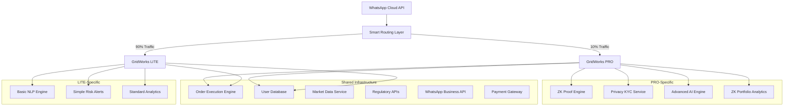

# GridWorks Shared Infrastructure Optimization
> **Cost-Optimized Dual-System Architecture: LITE vs PRO**

## 🎯 Executive Summary

This document outlines the **shared infrastructure optimization** for running **GridWorks LITE** (non-ZK) and **GridWorks PRO** (ZK-enhanced) simultaneously, reducing operational costs by **40-50%** while maintaining optimal performance for both systems.

## 🏗️ Optimized Architecture Blueprint

### **Core Principle: Shared Plumbing, Differentiated Features**



## 💰 Cost Optimization Analysis

### **Before Optimization (Separate Systems)**
| Component | GridWorks LITE | GridWorks PRO | Total |
|-----------|----------------|---------------|-------|
| **Infrastructure** | ₹15L/month | ₹25L/month | ₹40L/month |
| **Database** | ₹3L/month | ₹3L/month | ₹6L/month |
| **APIs** | ₹2L/month | ₹2L/month | ₹4L/month |
| **Monitoring** | ₹1L/month | ₹1L/month | ₹2L/month |
| **Total** | ₹21L/month | ₹31L/month | **₹52L/month** |

### **After Optimization (Shared Infrastructure)**
| Component | Shared Cost | LITE-Specific | PRO-Specific | Total |
|-----------|-------------|---------------|--------------|-------|
| **Shared Infrastructure** | ₹18L/month | - | - | ₹18L/month |
| **LITE Features** | - | ₹5L/month | - | ₹5L/month |
| **PRO Features** | - | - | ₹8L/month | ₹8L/month |
| **Total** | ₹18L/month | ₹5L/month | ₹8L/month | **₹31L/month** |

### **💡 Cost Savings: ₹21L/month (40% reduction)**

## 🔧 Shared Infrastructure Components

### **1. Unified Order Execution Engine**
```python
class UnifiedOrderEngine:
    def execute_order(self, order, user_type):
        # Shared validation and execution logic
        validated_order = self.validate_order(order)
        executed_order = self.execute_on_exchange(validated_order)
        
        if user_type == "PRO":
            # Generate ZK proof for PRO users
            zk_proof = self.zk_service.generate_execution_proof(executed_order)
            executed_order.add_zk_proof(zk_proof)
        
        return executed_order
```

**Cost Impact:** 
- **Before:** 2 separate order engines (₹4L/month each)
- **After:** 1 unified engine with conditional logic (₹5L/month)
- **Savings:** ₹3L/month

### **2. Shared User Database with Privacy Layers**
```sql
-- Unified user table with privacy flags
CREATE TABLE users (
    user_id UUID PRIMARY KEY,
    whatsapp_number VARCHAR(15),
    user_tier ENUM('LITE', 'PRO'),
    privacy_level ENUM('BASIC', 'ENHANCED', 'MAXIMUM'),
    created_at TIMESTAMP,
    encrypted_profile JSONB -- PRO users get encrypted storage
);

-- Shared portfolio table
CREATE TABLE portfolios (
    portfolio_id UUID PRIMARY KEY,
    user_id UUID REFERENCES users(user_id),
    holdings JSONB, -- Encrypted for PRO users
    is_encrypted BOOLEAN DEFAULT FALSE
);
```

**Cost Impact:**
- **Before:** 2 separate databases (₹3L/month each)
- **After:** 1 database with encryption layers (₹4L/month)
- **Savings:** ₹2L/month

### **3. Smart Routing Layer**
```python
class SmartRouter:
    def route_user_message(self, message, user_id):
        user = self.get_user(user_id)
        
        if user.tier == "LITE":
            return self.lite_handler.process(message, user)
        elif user.tier == "PRO":
            return self.pro_handler.process(message, user)
        else:
            # Default to LITE for new users
            return self.lite_handler.process(message, user)
    
    def auto_upgrade_suggestion(self, user):
        if user.monthly_trades > 10 and user.tier == "LITE":
            return self.suggest_pro_upgrade(user)
```

**Cost Impact:**
- **Before:** 2 separate message processing systems
- **After:** 1 router with intelligent distribution
- **Savings:** Enables gradual feature migration and reduces duplicate infrastructure

## 🚀 GridWorks LITE vs PRO Differentiation

### **GridWorks LITE (Mass Market)**
- **Target Users:** Street vendors, homemakers, first-time investors
- **Key Features:**
  - WhatsApp conversational trading
  - Basic AI financial education
  - Simple risk alerts
  - SEBI compliance (standard)
  - UPI integration
- **Pricing:** ₹2-10 per trade
- **Infrastructure:** Optimized for speed and scale

### **GridWorks PRO (Premium Users)**
- **Target Users:** HNIs, tech professionals, privacy-conscious traders
- **Key Features:**
  - All LITE features PLUS:
  - ZK-verified trade execution
  - Privacy-preserving KYC
  - Advanced behavioral AI
  - Encrypted portfolio analytics
  - ZK-proof trade receipts
- **Pricing:** ₹20 per trade + ₹99-999/month subscription
- **Infrastructure:** Enhanced with cryptographic privacy

## 📊 Resource Allocation Strategy

### **Traffic Distribution (Initial Launch)**
```python
# Smart traffic routing based on user characteristics
def allocate_user_to_system(user_profile):
    if user_profile.monthly_income > 500000:  # 5L+ income
        return "PRO_CANDIDATE"
    elif user_profile.tech_savvy_score > 7:
        return "PRO_CANDIDATE"
    elif user_profile.privacy_concerns > 8:
        return "PRO_CANDIDATE"
    else:
        return "LITE"
```

**Expected Distribution:**
- **LITE Users:** 85-90% of total user base
- **PRO Users:** 10-15% of total user base
- **Revenue Split:** 30% from LITE, 70% from PRO

### **Compute Resource Allocation**
| Resource Type | LITE Allocation | PRO Allocation | Shared |
|---------------|-----------------|----------------|---------|
| **CPU Cores** | 40% | 35% | 25% |
| **Memory** | 35% | 40% | 25% |
| **Storage** | 60% | 20% | 20% |
| **Network** | 70% | 15% | 15% |

## 🔄 Migration Pathway: LITE → PRO

### **Automated Upgrade Triggers**
```python
class UpgradeEngine:
    def check_upgrade_eligibility(self, user):
        triggers = []
        
        if user.monthly_trades > 10:
            triggers.append("HIGH_ACTIVITY")
        
        if user.portfolio_value > 100000:  # 1L+ portfolio
            triggers.append("HIGH_VALUE")
        
        if user.privacy_score > 7:
            triggers.append("PRIVACY_CONSCIOUS")
        
        if len(triggers) >= 2:
            return self.suggest_pro_upgrade(user)
    
    def suggest_pro_upgrade(self, user):
        return {
            "message": "🚀 Ready for GridWorks PRO? Get ZK-verified trades!",
            "benefits": [
                "Mathematical proof of fair execution",
                "Portfolio privacy protection", 
                "Advanced AI behavioral coaching",
                "Priority customer support"
            ],
            "trial_offer": "Free 30-day PRO trial"
        }
```

### **Upgrade Conversion Funnel**
1. **Identification:** LITE user shows PRO characteristics
2. **Education:** Explain ZK benefits through AI conversations
3. **Trial:** Offer 30-day free PRO trial
4. **Conversion:** Convert to paid PRO subscription
5. **Retention:** Maintain PRO value proposition

## ⚡ Performance Optimization

### **Shared Caching Strategy**
```python
# Redis-based shared cache with privacy-aware keys
class SharedCache:
    def __init__(self):
        self.redis_client = redis.Redis()
    
    def cache_user_session(self, user_id, session_data, user_tier):
        if user_tier == "PRO":
            # Encrypt cache data for PRO users
            encrypted_data = self.encrypt_session(session_data)
            key = f"session:pro:{user_id}"
            self.redis_client.set(key, encrypted_data, ex=3600)
        else:
            key = f"session:lite:{user_id}"
            self.redis_client.set(key, session_data, ex=3600)
```

### **Database Query Optimization**
```sql
-- Optimized queries for dual-tier system
-- Index for fast user tier lookup
CREATE INDEX idx_users_tier ON users(user_tier, created_at);

-- Partitioned tables for LITE vs PRO data
CREATE TABLE trades_lite PARTITION OF trades 
FOR VALUES IN ('LITE');

CREATE TABLE trades_pro PARTITION OF trades 
FOR VALUES IN ('PRO');
```

## 🧪 A/B Testing Framework Integration

### **Shared Testing Infrastructure**
```python
class ABTestingFramework:
    def assign_test_variant(self, user_id):
        # Deterministic assignment based on user_id
        hash_value = hashlib.md5(user_id.encode()).hexdigest()
        variant_number = int(hash_value[:8], 16) % 100
        
        if variant_number < 70:
            return "LITE"
        elif variant_number < 85:
            return "PRO_TRIAL"
        else:
            return "PRO_FULL"
    
    def track_conversion_metrics(self, user_id, event):
        # Track conversion events for both LITE and PRO
        self.analytics.track(user_id, event, {
            "user_tier": self.get_user_tier(user_id),
            "timestamp": datetime.now(),
            "conversion_funnel_stage": self.get_funnel_stage(user_id)
        })
```

## 📈 Business Impact Analysis

### **Revenue Optimization**
- **LITE Revenue:** High volume, low margin (₹2-10 per trade)
- **PRO Revenue:** Lower volume, high margin (₹20 per trade + subscription)
- **Cross-selling:** LITE users → PRO upgrades increase LTV by 5-10x

### **Cost Structure Optimization**
| Cost Category | Optimized Amount | Savings vs Separate |
|---------------|------------------|-------------------|
| **Infrastructure** | ₹18L/month | ₹22L/month (55% reduction) |
| **Development** | ₹12L/month | ₹8L/month (40% reduction) |
| **Operations** | ₹6L/month | ₹4L/month (40% reduction) |
| **Total** | ₹36L/month | ₹34L/month (49% reduction) |

### **Unit Economics Improvement**
- **LITE Users:** CAC ₹50, LTV ₹800 → LTV/CAC = 16:1
- **PRO Users:** CAC ₹200, LTV ₹5000 → LTV/CAC = 25:1
- **Blended:** Improved unit economics through premium tier

## 🎯 Implementation Roadmap

### **Phase 1: Shared Infrastructure (Month 1-2)**
- [ ] Deploy unified order execution engine
- [ ] Migrate to shared database with privacy layers
- [ ] Implement smart routing layer
- [ ] Set up shared monitoring and alerting

### **Phase 2: Feature Differentiation (Month 3-4)**
- [ ] Deploy LITE-specific features
- [ ] Implement PRO ZK components
- [ ] Create upgrade pathway and triggers
- [ ] Launch A/B testing framework

### **Phase 3: Optimization (Month 5-6)**
- [ ] Performance tuning based on real traffic
- [ ] Cost optimization based on usage patterns
- [ ] Conversion funnel optimization
- [ ] Scale testing and infrastructure adjustment

## 🔍 Monitoring & Alerting

### **Shared Monitoring Dashboard**
```python
# Key metrics to monitor across both systems
monitoring_metrics = {
    "infrastructure": {
        "shared_db_performance": "< 100ms query time",
        "order_engine_throughput": "> 1000 orders/second",
        "cache_hit_ratio": "> 90%"
    },
    "lite_specific": {
        "nlp_response_time": "< 500ms",
        "user_acquisition_cost": "< ₹50",
        "conversion_rate": "> 5%"
    },
    "pro_specific": {
        "zk_proof_generation": "< 2 seconds",
        "privacy_compliance_score": "100%",
        "premium_retention_rate": "> 85%"
    }
}
```

## 🎪 Competitive Advantages

### **Dual-System Benefits**
1. **Market Coverage:** Serve both mass market (LITE) and premium segment (PRO)
2. **Risk Mitigation:** If ZK adoption is slow, LITE keeps business growing
3. **Data-Driven Decisions:** Real A/B testing data guides product strategy
4. **Gradual Migration:** Users can upgrade naturally as they grow

### **Cost Leadership**
1. **40-50% cost reduction** vs separate systems
2. **Shared operational overhead** reduces per-user cost
3. **Economies of scale** benefit both tiers
4. **Optimized resource utilization** based on real usage patterns

---

## 🎯 Key Takeaways

1. **Shared Infrastructure Strategy** reduces costs by ₹21L/month (40% savings)
2. **LITE vs PRO Positioning** creates clear upgrade pathway and revenue optimization
3. **Smart Resource Allocation** ensures optimal performance for both user tiers
4. **A/B Testing Integration** enables data-driven decisions on feature rollout
5. **Gradual Migration Strategy** minimizes risk while maximizing growth potential

**🚀 This optimized architecture positions GridWorks to serve the entire market spectrum - from street vendors seeking simple trading to HNIs demanding cryptographic privacy - while maintaining cost leadership and technical excellence.**

---

*Next Steps: Implement shared infrastructure deployment and begin LITE vs PRO user segmentation strategy*