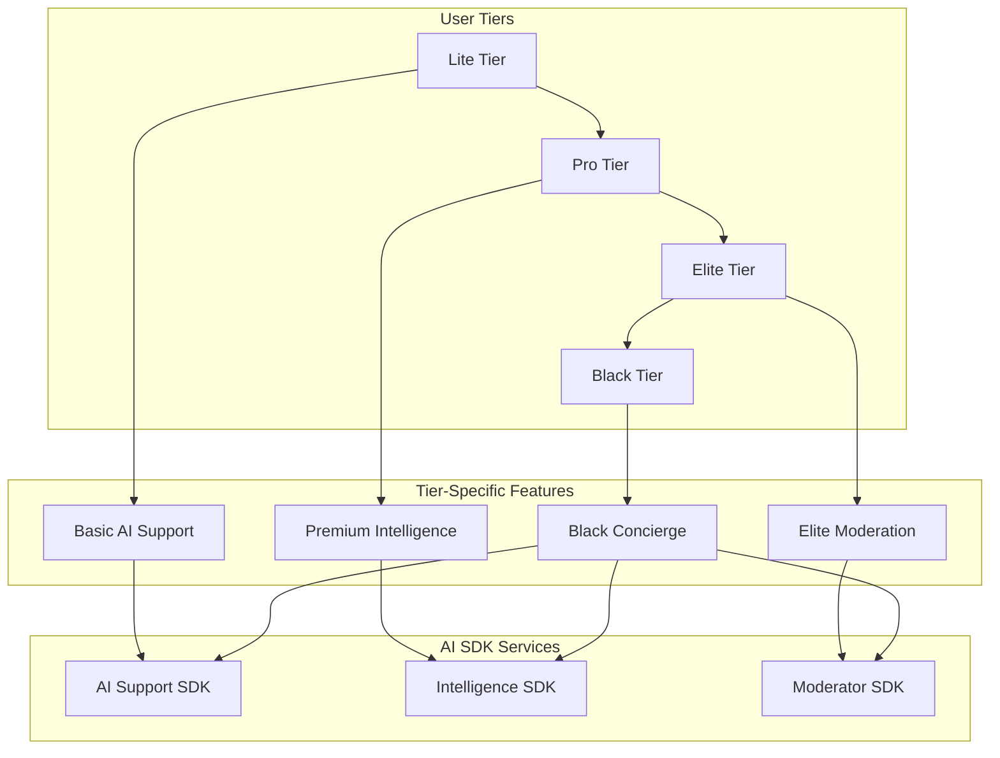

# 🎯 GridWorks AI SDK Tier Integration Architecture

> **How AI Services Scale Across Lite → Pro → Elite → Black Tiers**

---

## 🏗️ **Tier-Integrated AI Architecture**



---

## 🎯 **Tier-by-Tier SDK Integration**

### **🔵 LITE TIER** - Entry Level with AI Taste
*Target: Mass market users, freemium conversion*

#### **AI Support SDK Integration**
```python
# Lite tier support configuration
lite_support_config = {
    "response_time_sla": 30,  # 30 seconds
    "ai_agent_tier": "junior",
    "max_queries_per_day": 5,
    "languages": ["english", "hindi"],
    "features": [
        "basic_ai_chat",
        "order_status_queries", 
        "simple_portfolio_questions"
    ],
    "escalation": {
        "human_wait_time": 120,  # 2 minutes
        "agent_tier": "junior"
    },
    "whatsapp_delivery": False,  # API only
    "zk_privacy": "basic"
}
```

#### **Intelligence SDK Integration**
```python
# Lite tier intelligence (FREE with ads)
lite_intelligence_config = {
    "morning_pulse": {
        "enabled": True,
        "format": "text_summary_only",  # No voice notes
        "global_triggers": 2,  # Top 2 only
        "trade_ideas": 0,  # No specific trade ideas
        "delivery": ["app_notification"],
        "frequency": "weekdays_only"
    },
    "custom_alerts": False,
    "institutional_flows": False,
    "ad_supported": True
}
```

#### **Moderator SDK Integration**
```python
# Lite tier - Read-only in premium groups
lite_moderator_config = {
    "group_access": "observer_only",
    "can_post": False,
    "can_create_groups": False,
    "expert_verification": False,
    "call_tracking": "view_only"
}
```

**Lite Tier User Journey:**
```
User gets basic AI help → Sees morning pulse summary → Observes expert groups
↓
Conversion trigger: "Upgrade to Pro for trade ideas and voice notes"
```

---

### **🟡 PRO TIER** - Full AI Power Unlocked
*Target: Active traders, primary revenue driver*

#### **AI Support SDK Integration**
```python
# Pro tier support configuration
pro_support_config = {
    "response_time_sla": 15,  # 15 seconds
    "ai_agent_tier": "senior",
    "max_queries_per_day": 50,
    "languages": ["all_11_supported"],
    "features": [
        "advanced_ai_chat",
        "portfolio_analysis", 
        "trading_strategy_help",
        "technical_analysis_queries",
        "order_optimization_advice"
    ],
    "escalation": {
        "human_wait_time": 30,  # 30 seconds
        "agent_tier": "senior"
    },
    "whatsapp_delivery": True,  # Voice notes enabled
    "zk_privacy": "enhanced",
    "priority_queue": True
}
```

#### **Intelligence SDK Integration**
```python
# Pro tier intelligence (₹499/month)
pro_intelligence_config = {
    "morning_pulse": {
        "enabled": True,
        "format": "voice_note_plus_text",  # 30-sec voice summary
        "global_triggers": 5,  # Top 5 triggers
        "trade_ideas": 3,  # 3 specific ideas with entry/exit
        "delivery": ["whatsapp", "app", "email"],
        "frequency": "daily_including_weekends"
    },
    "custom_alerts": True,
    "backtesting_links": True,
    "institutional_flows": "basic",  # FII/DII summary
    "risk_alerts": True
}
```

#### **Moderator SDK Integration**
```python
# Pro tier - Can join verified expert groups
pro_moderator_config = {
    "group_access": "premium_groups",
    "can_post": True,
    "can_create_groups": False,
    "expert_verification": "can_apply",
    "call_tracking": "full_analytics",
    "max_groups": 3,
    "group_subscription_budget": 5000  # ₹5K/month for group subscriptions
}
```

**Pro Tier User Journey:**
```
Voice morning pulse → Executes trade ideas → Joins expert groups → Tracks performance
↓ 
Conversion trigger: "Upgrade to Elite for portfolio butler and exclusive groups"
```

---

### **🟣 ELITE TIER** - AI-Powered Trading Butler  
*Target: HNI traders, high-margin customers*

#### **AI Support SDK Integration**
```python
# Elite tier support configuration
elite_support_config = {
    "response_time_sla": 10,  # 10 seconds
    "ai_agent_tier": "expert",
    "max_queries_per_day": "unlimited",
    "languages": ["all_plus_regional_dialects"],
    "features": [
        "portfolio_butler_ai",
        "trading_strategy_optimization",
        "risk_management_advisor", 
        "market_research_assistant",
        "tax_optimization_guidance",
        "derivatives_strategy_help"
    ],
    "escalation": {
        "human_wait_time": 5,  # 5 seconds
        "agent_tier": "expert"
    },
    "whatsapp_delivery": True,
    "video_support": True,  # Video calls with AI avatars
    "zk_privacy": "premium",
    "dedicated_support_manager": True
}
```

#### **Intelligence SDK Integration**
```python
# Elite tier intelligence (₹2999/month)
elite_intelligence_config = {
    "morning_pulse": {
        "enabled": True,
        "format": "personalized_video_briefing",  # AI-generated video
        "global_triggers": "all_relevant",
        "trade_ideas": 5,  # 5 ideas with risk analysis
        "delivery": ["whatsapp_video", "app", "email", "sms"],
        "frequency": "real_time_updates"
    },
    "custom_alerts": "unlimited",
    "backtesting_links": True,
    "institutional_flows": "detailed",  # Block deals, insider activity
    "risk_alerts": "predictive",
    "portfolio_optimization": True,
    "sector_rotation_signals": True
}
```

#### **Moderator SDK Integration**
```python
# Elite tier - Can create and monetize expert groups
elite_moderator_config = {
    "group_access": "all_including_exclusive",
    "can_post": True,
    "can_create_groups": True,
    "expert_verification": "fast_track_approval",
    "call_tracking": "advanced_analytics_plus_followers",
    "max_groups": "unlimited",
    "revenue_sharing": {
        "can_monetize": True,
        "revenue_split": 75,  # Elite gets 75%
        "max_subscription_price": 9999
    },
    "moderation_tools": "basic_ai_moderation"
}
```

**Elite Tier User Journey:**
```
Personal AI briefing → Portfolio optimization → Creates expert groups → Earns revenue
↓
Conversion trigger: "Upgrade to Black for institutional intelligence and market butler"
```

---

### **⚫ BLACK TIER** - AI Market Butler & Institutional Intelligence
*Target: Ultra HNI, institutions, professional traders*

#### **AI Support SDK Integration**
```python
# Black tier support configuration
black_support_config = {
    "response_time_sla": 5,  # 5 seconds
    "ai_agent_tier": "market_butler",
    "max_queries_per_day": "unlimited",
    "languages": ["all_plus_custom_terminology"],
    "features": [
        "dedicated_ai_market_butler",
        "institutional_research_access",
        "algorithmic_trading_assistance",
        "hedge_fund_strategy_advisor",
        "regulatory_compliance_assistant",
        "cross_asset_correlation_analysis",
        "alternative_investment_guidance"
    ],
    "escalation": {
        "human_wait_time": 1,  # 1 second
        "agent_tier": "dedicated_relationship_manager"
    },
    "whatsapp_delivery": True,
    "video_support": True,
    "dedicated_phone_line": True,
    "zk_privacy": "institutional_grade",
    "white_glove_service": True
}
```

#### **Intelligence SDK Integration**
```python
# Black tier intelligence (₹25K/month)
black_intelligence_config = {
    "morning_pulse": {
        "enabled": True,
        "format": "institutional_research_report",  # 10-page analysis
        "global_triggers": "comprehensive_macro_analysis",
        "trade_ideas": 10,  # 10 ideas across asset classes
        "delivery": ["private_app", "encrypted_email", "whatsapp", "bloomberg_terminal"],
        "frequency": "continuous_updates"
    },
    "custom_alerts": "ai_powered_predictive",
    "backtesting_links": "institutional_grade",
    "institutional_flows": "real_time_insider", # Real-time institutional activity
    "risk_alerts": "portfolio_level_risk_management",
    "portfolio_optimization": "multi_asset_class",
    "sector_rotation_signals": "with_macro_timing",
    "alternative_investments": True,
    "derivatives_strategies": "institutional_grade",
    "regulatory_updates": "real_time"
}
```

#### **Moderator SDK Integration**
```python
# Black tier - Full platform capabilities
black_moderator_config = {
    "group_access": "platform_admin_level",
    "can_post": True,
    "can_create_groups": "unlimited_institutional",
    "expert_verification": "instant_approval_with_sebi_check",
    "call_tracking": "institutional_grade_analytics",
    "max_groups": "unlimited",
    "revenue_sharing": {
        "can_monetize": True,
        "revenue_split": 85,  # Black gets 85%
        "max_subscription_price": "unlimited",
        "institutional_pricing": True
    },
    "moderation_tools": "full_ai_plus_human_team",
    "white_label_groups": True,  # Can brand groups with own logo
    "api_access": "full_platform_api"
}
```

**Black Tier User Journey:**
```
Institutional briefing → Multi-asset strategies → Manages expert network → Platform revenue share
```

---

## 🔄 **Tier Progression Strategy**

### **AI-Driven Upsell Triggers**

#### **Lite → Pro Conversion**
```python
# AI detects usage patterns and triggers upsell
def lite_to_pro_trigger(user_activity):
    triggers = [
        user_activity.support_queries > 5,  # Hit daily limit
        user_activity.morning_pulse_opens > 10,  # Engaged with content
        user_activity.group_observer_time > 30,  # Wants to participate
        user_activity.trade_idea_clicks > 5  # Wants specific ideas
    ]
    
    if any(triggers):
        return {
            "message": "Unlock voice notes and trade ideas for just ₹499/month",
            "offer": "First month free",
            "demo": "Show trade idea that would have made ₹5000 today"
        }
```

#### **Pro → Elite Conversion**
```python
def pro_to_elite_trigger(user_activity):
    triggers = [
        user_activity.portfolio_value > 500000,  # ₹5L+ portfolio
        user_activity.monthly_trading_volume > 50,  # Active trader
        user_activity.group_subscriptions >= 2,  # Paying for expert groups
        user_activity.voice_note_engagement > 0.8  # High engagement
    ]
    
    if any(triggers):
        return {
            "message": "Get personal AI butler and create expert groups",
            "offer": "Video consultation with portfolio optimization",
            "revenue_potential": "Earn ₹25K/month from your expertise"
        }
```

#### **Elite → Black Conversion**
```python
def elite_to_black_trigger(user_activity):
    triggers = [
        user_activity.portfolio_value > 5000000,  # ₹50L+ portfolio
        user_activity.expert_group_revenue > 15000,  # Earning ₹15K+/month
        user_activity.institutional_queries > 0,  # Needs institutional features
        user_activity.multi_asset_interest > 0  # Beyond equity trading
    ]
    
    if any(triggers):
        return {
            "message": "Access institutional intelligence and market butler",
            "offer": "Dedicated relationship manager + institutional research",
            "value_prop": "Save ₹10L/year in research costs"
        }
```

### **Cross-Tier Feature Teasing**

#### **In Lite Tier - Show Pro Features**
```python
# When Lite user views morning pulse
morning_pulse_lite = {
    "content": "NASDAQ down 1.2% → IT stocks may open weak",
    "teaser": "🎵 Hear full 30-second voice analysis + 3 trade ideas in Pro",
    "cta": "Upgrade to Pro for ₹499/month"
}
```

#### **In Pro Tier - Show Elite Features**
```python
# When Pro user joins expert group
expert_group_pro = {
    "access": "Can view and follow expert calls",
    "teaser": "💎 Create your own expert group and earn ₹25K/month in Elite",
    "cta": "Upgrade to Elite and start monetizing your expertise"
}
```

#### **In Elite Tier - Show Black Features**
```python
# When Elite user hits revenue limits
elite_revenue_limit = {
    "current": "Earning ₹25K/month from expert groups",
    "teaser": "🏛️ Access institutional flows and unlimited earning potential in Black",
    "cta": "Upgrade to Black for institutional-grade intelligence"
}
```

---

## 💰 **Revenue Architecture Across Tiers**

### **Tier Revenue Breakdown**

| **Tier** | **Monthly Price** | **AI SDK Costs** | **Gross Margin** | **Features Unlocked** |
|----------|------------------|------------------|------------------|----------------------|
| **Lite** | Free (Ad revenue) | ₹50/user/month | 60% | Basic AI + Intelligence teasers |
| **Pro** | ₹999/month | ₹200/user/month | 80% | Full AI Suite + Voice + Groups |
| **Elite** | ₹4999/month | ₹500/user/month | 90% | Personal Butler + Group Creation |
| **Black** | ₹25000/month | ₹2000/user/month | 92% | Institutional + White Label |

### **AI SDK Revenue Attribution**

#### **Direct Revenue (B2C)**
```python
tier_revenue_distribution = {
    "lite": {
        "users": 1000000,  # 10L users
        "revenue_per_user": 0,  # Ad-supported
        "ai_cost_per_user": 50,
        "net_revenue": -50000000  # ₹5Cr cost (acquisition investment)
    },
    "pro": {
        "users": 100000,  # 1L users  
        "revenue_per_user": 999,
        "ai_cost_per_user": 200,
        "net_revenue": 79900000  # ₹79.9Cr profit
    },
    "elite": {
        "users": 10000,  # 10K users
        "revenue_per_user": 4999,
        "ai_cost_per_user": 500, 
        "net_revenue": 44990000  # ₹44.99Cr profit
    },
    "black": {
        "users": 1000,  # 1K users
        "revenue_per_user": 25000,
        "ai_cost_per_user": 2000,
        "net_revenue": 23000000  # ₹23Cr profit
    }
}

# Total B2C Revenue: ₹147.89Cr profit from AI SDK integration
```

#### **Indirect Revenue (B2B SDK Licensing)**
```python
b2b_sdk_revenue = {
    "broker_integrations": {
        "clients": 50,  # 50 brokers
        "revenue_per_client": 500000,  # ₹5L/year average
        "total_revenue": 25000000  # ₹25Cr
    },
    "whatsapp_business": {
        "clients": 200,  # 200 businesses
        "revenue_per_client": 120000,  # ₹1.2L/year
        "total_revenue": 24000000  # ₹24Cr
    },
    "trading_groups": {
        "groups": 1000,  # 1000 groups
        "revenue_share": 20,  # 20% platform cut
        "avg_group_revenue": 50000,  # ₹50K/month/group
        "total_revenue": 120000000  # ₹120Cr (20% of ₹600Cr group economy)
    }
}

# Total B2B Revenue: ₹169Cr from SDK licensing
# Combined Revenue: ₹316.89Cr from AI SDK ecosystem
```

---

## 🎯 **Implementation in Existing Codebase**

### **Tier Configuration Integration**

```python
# Add to existing app/models/user.py
class UserTier(Enum):
    LITE = "lite"
    PRO = "pro" 
    ELITE = "elite"
    BLACK = "black"

class User(Base):
    # ... existing fields ...
    tier: UserTier = UserTier.LITE
    ai_quota_used: int = 0
    ai_quota_limit: int = 5  # Based on tier
    expert_status: Optional[str] = None
    revenue_earned: Decimal = 0
    
    def get_ai_config(self) -> Dict[str, Any]:
        """Get tier-specific AI configuration"""
        return TIER_AI_CONFIGS[self.tier]
```

### **Tier-Aware SDK Integration**

```python
# Add to existing app/main.py
from app.sdk_manager import GridWorksSDK

# Initialize SDK with tier-aware configuration
async def get_user_sdk(user: User) -> GridWorksSDK:
    tier_config = user.get_ai_config()
    
    client_config = ClientConfiguration(
        client_id=f"user_{user.id}",
        client_name=f"GridWorks User {user.tier.value}",
        api_key=user.api_key,
        services=tier_config["services"],
        custom_settings=tier_config,
        rate_limits=tier_config["rate_limits"]
    )
    
    sdk = GridWorksSDK(client_config)
    await sdk.initialize_services()
    return sdk
```

### **Tier-Specific API Endpoints**

```python
# Add to app/api/v1/ai_services.py
@router.post("/support/query")
async def ai_support_query(
    request: SupportQueryRequest,
    user: User = Depends(get_current_user),
    sdk: GridWorksSDK = Depends(get_user_sdk)
):
    # Check tier limits
    if not user.can_use_ai_support():
        raise HTTPException(
            status_code=402,
            detail=f"Upgrade to {user.next_tier()} for more AI support queries"
        )
    
    # Process with tier-appropriate configuration
    response = await sdk.process_request(
        service="support",
        action="query", 
        data=request.dict(),
        user_context=user.get_context()
    )
    
    # Track usage and trigger upsells
    await user.track_ai_usage("support_query")
    await check_upsell_triggers(user, "support_query_limit")
    
    return response

@router.get("/intelligence/morning-pulse")
async def get_morning_pulse(
    user: User = Depends(get_current_user),
    sdk: GridWorksSDK = Depends(get_user_sdk)
):
    if user.tier == UserTier.LITE:
        # Show teaser version
        return await get_lite_morning_pulse_teaser(user)
    
    # Full morning pulse for Pro+
    response = await sdk.process_request(
        service="intelligence",
        action="morning_pulse",
        data={"user_id": str(user.id), "user_tier": user.tier.value}
    )
    
    return response
```

---

## 🚀 **Go-to-Market Strategy by Tier**

### **Lite Tier Acquisition**
- **WhatsApp viral loops**: Share morning pulse summaries
- **Referral program**: "Invite 3 friends, get Pro features for 1 week"
- **Content marketing**: Free trading education with AI insights

### **Pro Tier Conversion** 
- **Free trial**: "Get tomorrow's voice pulse + trade ideas free"
- **Performance proof**: "Pro users averaged 15% higher returns"
- **FOMO**: "Only Pro users got the TCS short call that made ₹5000"

### **Elite Tier Conversion**
- **Revenue opportunity**: "Start earning ₹25K/month from your expertise"
- **Exclusive access**: "Join elite groups with <100 members"
- **Personal AI**: "Get your dedicated trading butler"

### **Black Tier Conversion**
- **Institutional intelligence**: "Access same data as hedge funds"
- **Revenue scaling**: "Unlimited earning potential"
- **White-glove service**: "Dedicated relationship manager"

---

## 🎯 **Success Metrics by Tier**

### **Tier Health Metrics**

| **Metric** | **Lite** | **Pro** | **Elite** | **Black** |
|------------|----------|---------|-----------|-----------|
| **Monthly Churn** | <10% | <5% | <3% | <1% |
| **Upsell Rate** | 15% | 25% | 35% | N/A |
| **AI Engagement** | 60% | 85% | 95% | 98% |
| **Revenue per User** | ₹0 | ₹999 | ₹4,999 | ₹25,000 |
| **Support Cost** | ₹50 | ₹200 | ₹500 | ₹2,000 |
| **Gross Margin** | -100% | 80% | 90% | 92% |

### **Cross-Tier Conversion Funnels**

```python
tier_conversion_rates = {
    "lite_to_pro": 0.15,      # 15% conversion
    "pro_to_elite": 0.10,     # 10% conversion  
    "elite_to_black": 0.05,   # 5% conversion
    
    "average_time_to_convert": {
        "lite_to_pro": 45,     # 45 days
        "pro_to_elite": 90,    # 90 days
        "elite_to_black": 180  # 180 days
    }
}
```

---

## 🏆 **The Unified Vision**

**GridWorks AI SDK integration creates a seamless progression:**

1. **Lite**: Taste AI intelligence → Want more
2. **Pro**: Experience full AI power → Want to create  
3. **Elite**: Create and monetize → Want institutional access
4. **Black**: Institutional intelligence → Platform partnership

**Each tier generates higher margin while the AI SDK costs decrease as percentage of revenue, creating a profitable scaling model that benefits from network effects.**

**This architecture positions GridWorks as both a consumer platform AND the B2B infrastructure that powers the entire fintech ecosystem.**