# GridWorks Black: The "Amex Black Card of Trading"
> **Strategic Positioning**: Hyper-Exclusive Premium Platform for Maximum Acquisition Value  
> **Target**: Top 0.5% of Traders | **Goal**: ₹1,200+ Cr Acquisition Valuation

---

## 🎯 Strategic Overview

### **Core Positioning**
GridWorks Black positions as the **"Amex Black Card of Trading"** - a hyper-exclusive, status-driven product that accelerates acquisition appeal while maintaining WhatsApp's mass-market dominance.

### **Acquisition Thesis**
- **Demonstrates HNI Capture**: Proves ability to monetize highest-value segment
- **Technology Differentiation**: Native app + AI + ZK privacy = acqui-hire potential  
- **Data Goldmine**: Elite trading patterns worth ₹500+ Cr to acquirers
- **Strategic Moat**: Creates defensible premium segment competitors can't replicate

---

## 🏛️ Brand Positioning Matrix

| **Attribute** | **Amex Black** | **GridWorks Black** |
|---------------|----------------|---------------------|
| **Exclusivity** | Invite-only, 1% of users | Top 0.5% traders (₹50L+ portfolio) |
| **Status Symbol** | Titanium card | "Black Badge" profile + SEBI-certified NFT |
| **Concierge** | 24/7 travel planner | Dedicated AI trader ("Market Butler") |
| **Mystique** | Rumored approval process | "Score hidden—only elites know" |
| **Access** | Airport lounges | Dark pools, institutional tools |
| **Network** | Elite events | SEBI/RBI executive dinners |

**Brand Tagline**: *"For those who trade beyond the charts."*

---

## 🎭 Tiered Access Architecture

### **Level 1: WhatsApp (Mass Market - 95% of users)**
**Target**: Street vendors to middle class  
**Features**: Voice trading, basic charts, education  
**Revenue**: ₹500-2,000/year per user  
**CTA**: *"Unlock Black status with ₹10L portfolio"*

### **Level 2: GridWorks Black (Elite - 5% of users)**
**Target**: HNIs, professionals, successful traders  
**Access**: Invite-only native app + WhatsApp concierge  
**Revenue**: ₹50,000-500,000/year per user

---

## 🏆 GridWorks Black Tiered System

### **🖤 Onyx Tier (₹50L-2Cr Portfolio)**
**Entry Requirements**:
- Invite-only after 6 months WhatsApp trading (50+ trades)
- Initiation fee: ₹25K (waived if portfolio >₹1Cr)

**Core Perks**:
- **"Market Butler" Lite**: AI trade alerts (30-min delay)
- **Basic Dark Pool**: 2% volume access
- **Status Symbols**: Black verified badge, exclusive emojis (🎯🔥)
- **Analytics**: Advanced portfolio insights

**Monetization**:
- ₹2K/month subscription for advanced analytics
- 0.02% commission on trades

**Psychological Hook**:
> *"You're in the top 5%—just 1 step from Obsidian."*

---

### **⚫ Obsidian Tier (₹2Cr-5Cr Portfolio)**
**Entry Requirements**:
- Refer 2 Onyx users OR maintain ₹2Cr for 3 months
- Portfolio diversity score >7/10

**Advanced Perks**:
- **"Market Butler" Pro**: Real-time algo trading APIs
- **ZK Privacy**: "Ghost mode" (hide trades from SEBI filings)
- **Dedicated Advisor**: SEBI-certified (5 calls/month)
- **Institutional Access**: Direct market maker connections
- **Exclusive Events**: Quarterly NSE executive Zooms

**Monetization**:
- 0.05% rebate on block trades (>₹50L)
- ₹5K/month for premium AI features
- 8% carry on co-investment opportunities

**Psychological Hook**:
> *"Aditi (Obsidian) just saved ₹1.2L in STT this month."*

---

### **🕳️ Void Tier (₹5Cr+ Portfolio)**
**Entry Requirements**:
- Invite-only by "Black Council" (3 existing Void members vouch)
- Demonstrated market influence/alpha generation

**Ultimate Perks**:
- **"Market Butler" Infinite**: Custom hedge fund strategies
- **Regulatory Access**: Early SEBI/RBI policy insights
- **Physical Luxuries**: Carbon-fiber Black Card with NFC auth
- **Elite Network**: Annual retreat with SEBI/RBI officials
- **Co-Investment Access**: Pre-IPO deals, PE opportunities

**Monetization**:
- 15% carry on co-investment opportunities
- ₹50K/month for infinite features
- 1% management fee on AUM

**Psychological Hook**:
> *"There are only 17 Void members in India. You've been nominated."*

---

## 💰 Revenue Model & Projections

### **User Distribution (Target: 10,000 Black Users)**
| Tier | Users | % of Black | Annual Revenue/User | Total Revenue |
|------|-------|------------|-------------------|---------------|
| **Onyx** | 8,500 | 85% | ₹84K | ₹71.4 Cr |
| **Obsidian** | 1,400 | 14% | ₹2.1L | ₹29.4 Cr |
| **Void** | 100 | 1% | ₹15L | ₹15 Cr |
| **Total** | **10,000** | **100%** | **Avg: ₹1.16L** | **₹115.8 Cr/year** |

### **Revenue Breakdown by Component**
| Revenue Stream | Onyx | Obsidian | Void | Total |
|----------------|------|----------|------|-------|
| Subscription Fees | ₹24K | ₹60K | ₹600K | ₹35 Cr |
| Trading Commissions | ₹45K | ₹150K | ₹500K | ₹60 Cr |
| Co-Investment Carry | - | ₹300K | ₹4,000K | ₹16 Cr |
| Advisory/Concierge | ₹15K | ₹100K | ₹200K | ₹4.8 Cr |

---

## 🧠 Psychological Triggers & UX Design

### **Artificial Scarcity**
- **App Dashboard**: *"7 seats left in Mumbai zone this quarter"*
- **Reality**: Dynamic caps based on acquisition timeline
- **Void Exclusivity**: *"Tier closed this quarter. Next review: 2025"*

### **Social Proof Engine**
- **Real-time Notifications**: *"3 Void members bought Paytm puts today"*
- **Performance Highlights**: *"Aditi (Onyx) just closed ₹12L on Nifty puts"*
- **Peer Comparison**: *"You're 82% to her level"*

### **Loss Aversion**
- **Status Warnings**: *"Obsidian status expires in 7 days. Maintain ₹2Cr to keep perks"*
- **Tier Demotion**: Automatic downgrade with 30-day grace period

### **Status Progression**


---

## 🚀 Invite-Only UX Flow

### **Step 1: Mysterious Trigger (WhatsApp)**
```python
if user.hni_score >= 950:  # Top 0.5%
    send_black_invite(user)
```

**UI Message**:
> *"Ramesh, your trading acumen has been observed.  
> **Curious?** Reply 'BLACK'—no guarantees."*

### **Step 2: Opaque Qualification**
- User enters waitlist queue with fake progress bar
- *"Assessing 3/7 criteria... 48h"* (Creates artificial scarcity)

### **Step 3: Video KYC + "Interview"**
- Zoom call with "Black Relationship Manager"
- Questions: *"How did you spot the Reliance breakout last week?"*
- **Real Purpose**: Verify net worth and trading sophistication

### **Step 4: Hardware-Locked App Delivery**
- SMS with exclusive download link
- App binds to single device (IMEI + biometrics)
- **Welcome Screen**: *"Welcome, Ramesh. You're 1 of 427. Your Black Tier: Obsidian (₹2Cr+)."*

---

## 💎 Co-Investment Platform (Void Tier Exclusive)

### **Deal Structure**

```mermaid
graph LR
    A[Void Member] -->|Invests ₹1Cr| B[GridWorks SPV]
    B -->|Deploys ₹50Cr Pool| C[Pre-IPO Startup]
    C -->|Exit at ₹150Cr| D[₹100Cr Profit]
    D --> E[Member: ₹85Cr]
    D --> F[GridWorks: ₹15Cr Carry]
```


### **Deal Flow Sources**
- **Pre-IPO Unicorns**: Razorpay, PharmEasy, Lenskart
- **PE Secondaries**: Distressed asset opportunities
- **Hedge Fund Co-Investments**: Quant fund strategies
- **Special Situations**: YES Bank AT1 revival, policy plays

### **Revenue Projections (50 Void Members)**
| Metric | Per Deal | Annual (5 Deals) |
|--------|----------|------------------|
| Average Investment Pool | ₹50Cr | ₹250Cr |
| Average Profit (2x return) | ₹50Cr | ₹250Cr |
| **GridWorks Carry (15%)** | **₹7.5Cr** | **₹37.5Cr** |
| Management Fees (1%) | ₹50L | ₹2.5Cr |
| Debt Interest (12%) | ₹6Cr | ₹30Cr |
| **Total Revenue** | **₹14Cr/deal** | **₹70Cr/year** |

---

## 🎯 Acquisition Strategy & Valuation

### **Why Incumbents Will Overpay**
1. **HNI Revenue Concentration**: 80% of brokerage revenue comes from top 5% users
2. **Data Goldmine**: Elite trading patterns monetizable via algo hedge funds
3. **Talent Acquisition**: "Market Butler" AI team becomes quant research division
4. **Strategic Moat**: Defensible premium segment competitors can't replicate

### **Valuation Boost Analysis**
| Asset | Zerodha's Lens | Valuation Impact |
|-------|----------------|------------------|
| **HNI User Base** | Saves ₹5K+ CAC per HNI | +₹500Cr for 10K HNIs |
| **Native App IP** | Saves 2 years R&D | +₹200Cr |
| **WhatsApp Integration** | Cross-sell to 10M users | +₹300Cr strategic premium |
| **Black Brand** | Premium positioning | +₹400Cr brand value |
| **Co-Investment Platform** | Alternative asset access | +₹700Cr (₹70Cr revenue × 10x) |

**Total Potential Uplift**: **₹2,100Cr** premium over base WhatsApp platform

### **Acquisition Scenarios**
| Scenario | Black Users | Annual Revenue | Valuation Multiple | Total Value |
|----------|-------------|----------------|-------------------|-------------|
| **Conservative** | 5,000 | ₹50Cr | 8x | ₹400Cr |
| **Target** | 10,000 | ₹116Cr | 10x | ₹1,160Cr |
| **Optimistic** | 15,000 | ₹200Cr | 12x | ₹2,400Cr |

---

## 🛠️ Technical Implementation

### **Technology Stack**
| Component | Technology | Cost | Notes |
|-----------|------------|------|-------|
| **Native App** | React Native/Swift/Kotlin | ₹2Cr | Shared WhatsApp backend |
| **Hardware Binding** | Device fingerprinting + biometrics | ₹15L | Security layer |
| **"Market Butler" AI** | GPT-4 + custom trading LLM | ₹50L/year | Core differentiation |
| **ZK Privacy Layer** | zk-SNARKs + AWS Nitro | ₹20L/year | Ghost mode implementation |
| **Co-Investment Platform** | SEBI AIF compliance setup | ₹50L | Legal + tech infrastructure |

**Total Implementation**: ₹3.5Cr one-time + ₹1.2Cr/year operational

### **Performance Targets**
- **App Response Time**: <50ms (vs WhatsApp <2s)
- **Trade Execution**: <100ms (institutional grade)
- **Data Privacy**: Zero-knowledge proof generation <500ms
- **Uptime**: 99.99% (vs WhatsApp 99.9%)

---

## 📊 User Acquisition & Retention Strategy

### **Acquisition Funnel**

```mermaid
graph TD
    A[1M WhatsApp Users] --> B[50K Portfolio >₹10L]
    B --> C[5K HNI Score >950]
    C --> D[2K Accept Invitation]
    D --> E[1.5K Complete Onboarding]
    E --> F[1K Active Black Users]
    
    A --> G[Conversion: 0.1%]
    F --> H[LTV: ₹3.27L]
```


### **Retention Mechanisms**
- **Status Investment**: Users invest in maintaining tier status
- **Network Effects**: Exclusive community creates switching costs
- **Sunk Cost Fallacy**: Initiation fees and time investment
- **Social Proof**: Public tier badges create reputational stakes

### **Growth Metrics**
| Metric | Month 6 | Month 12 | Month 24 |
|--------|---------|----------|----------|
| **Black Invitations Sent** | 2,000 | 5,000 | 15,000 |
| **Active Black Users** | 500 | 2,000 | 8,000 |
| **Monthly Revenue** | ₹4Cr | ₹15Cr | ₹50Cr |
| **Avg. Portfolio Size** | ₹1.2Cr | ₹2.1Cr | ₹3.5Cr |

---

## 🔒 Risk Management & Compliance

### **Regulatory Risks**
| Risk | Impact | Mitigation |
|------|--------|------------|
| **SEBI Scrutiny** | High | Position as "research lab" with opt-in features |
| **Exclusivity Concerns** | Medium | Maintain clear eligibility criteria |
| **Co-Investment Compliance** | High | Structure as SEBI Cat II AIF |

### **Competitive Risks**
| Risk | Impact | Mitigation |
|------|--------|------------|
| **Incumbent Cloning** | Medium | Patent "invite-to-trade" flow, hardware binding |
| **Invitation Leaks** | Medium | Hardware-bound app + ₹10L deposit requirement |
| **User Defection** | Low | High switching costs, network effects |

### **Operational Risks**
| Risk | Impact | Mitigation |
|------|--------|------------|
| **Technical Failures** | High | Redundant systems, 24/7 monitoring |
| **AI Hallucinations** | Medium | Human oversight, liability insurance |
| **Talent Retention** | Medium | Equity participation, premium compensation |

---

## 📈 Launch Timeline & Milestones

### **Phase 1: Stealth Launch (Months 1-3)**
- **Month 1**: Secret onboarding of 100 HNIs (founders, celebrity traders)
- **Month 2**: Beta testing with 500 users, feature refinement
- **Month 3**: "Accidental" leaks on TradingView (*"What's GridWorks Black?"*)

### **Phase 2: Controlled Expansion (Months 4-9)**
- **Month 4-6**: Gradual invitation expansion to 2,000 users
- **Month 7-9**: Feature enhancement, tier system refinement
- **Target**: 1,000 active paying users by Month 9

### **Phase 3: Acquisition Preparation (Months 10-12)**
- **Month 10-11**: Performance optimization, metrics documentation
- **Month 12**: Official launch + acquisition talks begin
- **Target**: ₹50Cr annual revenue run rate

### **Phase 4: Exit Execution (Months 13-18)**
- **Month 13-15**: Due diligence process with multiple acquirers
- **Month 16-18**: Final negotiations and deal closure
- **Target**: ₹1,200Cr+ acquisition value

---

## 🎪 Marketing & Brand Strategy

### **Brand Narrative**
*"We're not selling a trading app—we're selling entry into India's most exclusive financial guild."*

### **Content Strategy**
- **Mystery Marketing**: Vague LinkedIn posts about "exclusive trading community"
- **Influencer Seeding**: Celebrity traders accidentally mention Black status
- **FOMO Generation**: WhatsApp AI hints at missed opportunities for non-Black users

### **PR Strategy**
- **Media Positioning**: "The Amex Black of Indian Trading"
- **Success Stories**: Anonymous case studies of Void tier returns
- **Industry Recognition**: SEBI/RBI executive endorsements

### **Community Building**
- **Annual Black Summit**: Members-only event with SEBI chairperson
- **Quarterly Masterclasses**: Exclusive market insights sessions
- **Black Council**: Democratic governance by top-tier members

---

## 💡 Psychological Design Principles

### **Core Principles**
1. **Scarcity Creates Value**: Limited seats, invitation-only access
2. **Status Drives Behavior**: Public tier badges, social recognition
3. **Community Builds Loyalty**: Exclusive network, shared experiences
4. **Mystery Enhances Appeal**: Hidden criteria, opaque scoring

### **Cognitive Biases Leveraged**
- **Endowment Effect**: Users value what they "own" (tier status)
- **Social Proof**: Others' success validates platform value
- **Loss Aversion**: Fear of tier demotion drives engagement
- **Anchoring**: High initiation fees establish premium positioning

### **Gamification Elements**
- **Achievement Unlocks**: Tier progression, special features
- **Leaderboards**: Anonymous performance rankings
- **Challenges**: Monthly trading competitions with rewards
- **Badges**: Digital collectibles for milestones

---

## 🎯 Success Metrics & KPIs

### **User Metrics**
- **Acquisition Rate**: 50+ new Black users/month
- **Engagement**: 85%+ weekly active rate (vs 20% industry average)
- **Retention**: 90%+ annual retention (vs 60% industry average)
- **Portfolio Growth**: 25%+ annual increase in user AUM

### **Revenue Metrics**
- **ARPU**: ₹1L+ annual revenue per user
- **Revenue Growth**: 50%+ month-over-month
- **Margin**: 70%+ gross margin on subscriptions
- **LTV/CAC**: 20:1 ratio (vs 3:1 industry average)

### **Strategic Metrics**
- **Brand Recognition**: 80%+ awareness among HNI community
- **Acquisition Interest**: 3+ serious acquirer discussions
- **Valuation Multiple**: 10x+ revenue multiple
- **Technology Moats**: 5+ defensible IP assets

---

## 🔮 Long-Term Vision & Exit Strategy

### **The Endgame**
**GridWorks Black becomes the de facto standard for premium trading in India**, creating an exclusive ecosystem that incumbent brokerages cannot replicate due to:

1. **Network Effects**: Exclusive community creates switching costs
2. **Brand Moats**: "Black" status becomes social currency
3. **Technology Differentiation**: AI + ZK privacy + co-investment platform
4. **Regulatory Relationships**: Direct access to policymakers

### **Acquisition Scenarios**
| Acquirer | Strategic Rationale | Likely Offer | Timeline |
|----------|-------------------|--------------|----------|
| **Zerodha** | Premium segment capture | ₹1,200Cr | 18 months |
| **Upstox** | Competitive defense | ₹900Cr | 12 months |
| **ICICI Securities** | Digital transformation | ₹1,500Cr | 24 months |
| **Angel One** | HNI market entry | ₹800Cr | 15 months |

### **Fallback Strategy**
If acquisition doesn't materialize:
- **Standalone Profitability**: ₹50Cr/year at 1,000 users
- **IPO Pathway**: ₹3,000Cr+ valuation as independent entity
- **Strategic Partnerships**: Joint ventures with global players

---

## 🎪 The Black Council Governance Model

### **Structure**
- **Composition**: 5 top Void members + GridWorks CEO
- **Selection**: Democratic voting by all Void members
- **Term**: 2-year rotating terms with 1-year overlap

### **Responsibilities**
- **Membership Approval**: Vote on new Void tier candidates
- **Feature Governance**: Approve new platform features
- **Community Standards**: Set behavioral guidelines
- **Strategic Input**: Advise on platform direction

### **Acquisition Benefit**
- **Smooth Transition**: Council seats transfer to acquirer's advisory board
- **User Retention**: Democratic governance reduces acquisition friction
- **Brand Continuity**: Maintains exclusive community culture

---

## 🏁 Final Strategy Summary

### **Core Thesis**
GridWorks Black transforms a commodity trading app into an **exclusive financial guild**, creating:

1. **Defensible Moats**: Status-driven community impossible to replicate
2. **Premium Pricing Power**: 10x+ revenue per user vs mass market
3. **Acquisition Premium**: Strategic value beyond financial metrics
4. **Scalable Model**: Framework replicable in global markets

### **Key Success Factors**
- **Maintain Mystique**: Never fully explain selection criteria
- **Deliver Alpha**: Black users must outperform significantly
- **Build Community**: Foster genuine relationships among members
- **Execute Flawlessly**: Premium experience demands perfection

### **Risk Mitigation**
- **Regulatory Compliance**: Proactive SEBI engagement
- **Technology Reliability**: Enterprise-grade infrastructure
- **Talent Retention**: Equity participation for key team members
- **Competitive Defense**: Patent protection for key innovations

---

**One-Liner**: *"Amex Black built a card. We're building a cult."*

---

*This document represents a comprehensive strategy for creating India's most exclusive trading platform, designed to maximize both user value and acquisition potential.*

**Document Status**: Strategy Complete | **Next Review**: Post-Implementation  
**Owner**: GridWorks Strategy Team | **Confidentiality**: Restricted  
**Last Updated**: 2025-06-28