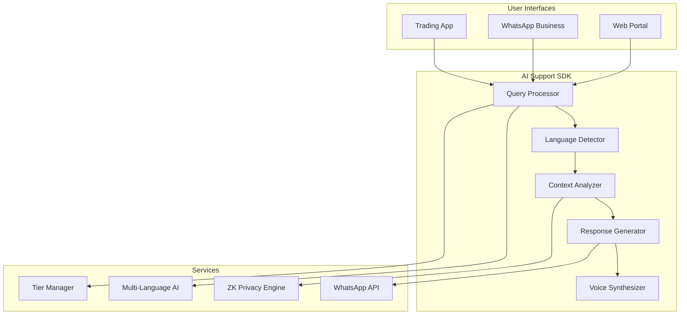

# AI Support SDK - Trust-as-a-Service

> **Instant, intelligent, multilingual trading support powered by AI**

The AI Support SDK transforms customer support with instant responses, multi-language capabilities, and WhatsApp integration. Built for trading platforms that need to provide 24/7 support without scaling human agents.

## 🎯 **Overview**

AI Support SDK provides **Trust-as-a-Service** by delivering:

- ⚡ **5-30 second response times** across all tiers
- 🌍 **11 Indian languages** plus English support
- 📱 **WhatsApp Business integration** with voice notes
- 🔒 **Zero-knowledge privacy** for sensitive trading data
- 🎛️ **Tier-based features** for revenue optimization

## 🏗️ **Architecture**



## 🚀 **Quick Integration**

### **1. Basic Setup**

```javascript
import { AISupport } from '@gridworks/ai-sdk-suite';

const aiSupport = new AISupport({
  apiKey: 'your_api_key',
  tier: 'pro',
  features: {
    multiLanguage: true,
    whatsappDelivery: true,
    zkPrivacy: true
  }
});

await aiSupport.initialize();
```

### **2. Process User Query**

```javascript
async function handleUserSupport(userId, query, context) {
  const response = await aiSupport.query({
    userId: userId,
    message: query,
    context: {
      balance: context.balance,
      portfolio: context.portfolio,
      recentOrders: context.recentOrders,
      riskProfile: context.riskProfile
    },
    language: context.language || 'auto-detect',
    deliveryChannels: ['app', 'whatsapp']
  });
  
  return {
    message: response.message,
    actions: response.suggestedActions,
    responseTime: response.processingTime,
    voiceNoteUrl: response.whatsappVoiceNote,
    followUpQuestions: response.followUpSuggestions
  };
}
```

### **3. WhatsApp Integration**

```javascript
// Setup WhatsApp Business webhook
app.post('/webhook/whatsapp', async (req, res) => {
  const { from, text, messageId } = req.body;
  
  try {
    // Get user context from phone number
    const userContext = await getUserByPhone(from);
    
    // Process query with AI Support
    const aiResponse = await aiSupport.processWhatsAppQuery({
      phoneNumber: from,
      message: text,
      userTier: userContext.tier,
      context: userContext
    });
    
    // Send response back via WhatsApp
    if (aiResponse.textResponse) {
      await sendWhatsAppMessage(from, aiResponse.textResponse);
    }
    
    if (aiResponse.voiceNote) {
      await sendWhatsAppVoice(from, aiResponse.voiceNote);
    }
    
    res.sendStatus(200);
  } catch (error) {
    console.error('WhatsApp AI Support error:', error);
    await sendWhatsAppMessage(from, 'I apologize, please try again in a moment.');
    res.sendStatus(500);
  }
});
```

## 🎛️ **Tier-Based Features**

### **Lite Tier - Basic AI Support**

```javascript
const liteConfig = {
  tier: 'lite',
  features: {
    dailyQuotaLimit: 5,
    responseTime: '30 seconds',
    languages: ['english', 'hindi'],
    whatsappDelivery: false,
    voiceResponses: false,
    aiPersonality: 'helpful_basic'
  }
};

// Example response for Lite tier
const liteResponse = await aiSupport.query({
  message: "Why did my order fail?",
  tier: 'lite'
});
// Response: "Order failures typically occur due to insufficient balance, market hours, or stock limits. Check your available balance and ensure markets are open."
```

### **Pro Tier - Enhanced AI Support**

```javascript
const proConfig = {
  tier: 'pro',
  features: {
    dailyQuotaLimit: 50,
    responseTime: '15 seconds',
    languages: ['all_11_supported'],
    whatsappDelivery: true,
    voiceResponses: true,
    aiPersonality: 'professional_trader',
    contextAwareness: 'enhanced'
  }
};

// Example response for Pro tier
const proResponse = await aiSupport.query({
  message: "मेरा ऑर्डर क्यों फेल हुआ?", // Hindi
  tier: 'pro',
  context: {
    balance: 45000,
    attemptedOrder: { symbol: 'RELIANCE', quantity: 20, price: 2450 }
  }
});
// Response includes voice note in Hindi + detailed analysis
```

### **Elite Tier - Personal AI Butler**

```javascript
const eliteConfig = {
  tier: 'elite',
  features: {
    dailyQuotaLimit: 'unlimited',
    responseTime: '10 seconds',
    languages: ['all_plus_dialects'],
    whatsappDelivery: true,
    voiceResponses: true,
    videoSupport: true,
    aiPersonality: 'expert_advisor',
    contextAwareness: 'comprehensive',
    portfolioAnalysis: true,
    proactiveInsights: true
  }
};

// Example Elite AI Butler response
const eliteResponse = await aiSupport.query({
  message: "Analyze my portfolio performance",
  tier: 'elite',
  context: {
    portfolioValue: 750000,
    holdings: portfolioData,
    riskProfile: 'moderate_aggressive'
  }
});
// Response includes video analysis + personalized recommendations
```

### **Black Tier - Institutional AI Butler**

```javascript
const blackConfig = {
  tier: 'black',
  features: {
    dailyQuotaLimit: 'unlimited',
    responseTime: '5 seconds',
    languages: ['all_plus_custom_terminology'],
    whatsappDelivery: true,
    voiceResponses: true,
    videoSupport: true,
    dedicatedSupport: true,
    aiPersonality: 'institutional_butler',
    contextAwareness: 'institutional_grade',
    portfolioAnalysis: 'multi_asset_class',
    regulatoryCompliance: true,
    institutionalInsights: true
  }
};

// Example Black tier institutional response
const blackResponse = await aiSupport.query({
  message: "Analyze regulatory impact on portfolio",
  tier: 'black',
  context: {
    institutionalPortfolio: institutionalData,
    regulatoryEnvironment: 'current_sebi_guidelines',
    riskParameters: institutionalRiskFramework
  }
});
// Response includes comprehensive regulatory analysis + compliance recommendations
```

## 🌍 **Multi-Language Support**

### **Supported Languages**

| **Language** | **Code** | **Voice Support** | **Tier Availability** |
|--------------|----------|-------------------|----------------------|
| English | `en` | ✅ | All tiers |
| Hindi | `hi` | ✅ | All tiers |
| Tamil | `ta` | ✅ | Pro+ |
| Telugu | `te` | ✅ | Pro+ |
| Kannada | `kn` | ✅ | Pro+ |
| Malayalam | `ml` | ✅ | Pro+ |
| Marathi | `mr` | ✅ | Pro+ |
| Gujarati | `gu` | ✅ | Pro+ |
| Bengali | `bn` | ✅ | Pro+ |
| Punjabi | `pa` | ✅ | Pro+ |
| Odia | `or` | ✅ | Elite+ |

### **Language Detection & Response**

```javascript
// Automatic language detection
const multiLangResponse = await aiSupport.query({
  message: "என் போர்ட்ஃபோலியோ எப்படி இருக்கிறது?", // Tamil
  languageDetection: 'auto'
});

// Response will be in Tamil with voice note
console.log(multiLangResponse.detectedLanguage); // 'ta'
console.log(multiLangResponse.message); // Tamil response
console.log(multiLangResponse.voiceNoteUrl); // Tamil voice note
```

### **Custom Language Preferences**

```javascript
// Set user language preferences
await aiSupport.setUserLanguagePreferences(userId, {
  primaryLanguage: 'hi', // Hindi
  fallbackLanguage: 'en', // English
  voiceLanguage: 'hi',
  textLanguage: 'en' // Mixed mode
});
```

## 📱 **WhatsApp Business Integration**

### **Setup WhatsApp Business Account**

```javascript
const whatsappConfig = {
  businessAccountId: 'your_whatsapp_business_id',
  phoneNumberId: 'your_phone_number_id',
  accessToken: 'your_whatsapp_access_token',
  webhookUrl: 'https://yourapp.com/webhook/whatsapp',
  verifyToken: 'your_verify_token'
};

await aiSupport.setupWhatsAppIntegration(whatsappConfig);
```

### **Voice Note Generation**

```javascript
// Generate voice notes for WhatsApp
async function generateVoiceResponse(message, language, userTier) {
  const voiceNote = await aiSupport.generateVoiceNote({
    text: message,
    language: language,
    voicePersonality: getTierVoicePersonality(userTier),
    speed: 1.0, // Normal speed
    emotion: 'professional_friendly'
  });
  
  return {
    audioUrl: voiceNote.url,
    duration: voiceNote.duration,
    fileSize: voiceNote.fileSize,
    format: 'ogg' // WhatsApp compatible
  };
}

// Tier-specific voice personalities
function getTierVoicePersonality(tier) {
  const voices = {
    lite: 'friendly_helper',
    pro: 'professional_advisor',
    elite: 'expert_consultant',
    black: 'institutional_advisor'
  };
  return voices[tier] || voices.lite;
}
```

### **Rich WhatsApp Responses**

```javascript
// Send rich responses with buttons and quick replies
async function sendRichWhatsAppResponse(phoneNumber, aiResponse) {
  if (aiResponse.hasQuickActions) {
    await sendWhatsAppInteractiveMessage(phoneNumber, {
      text: aiResponse.message,
      buttons: [
        { id: 'check_balance', title: 'Check Balance' },
        { id: 'view_portfolio', title: 'View Portfolio' },
        { id: 'place_order', title: 'Place Order' }
      ]
    });
  }
  
  if (aiResponse.hasVoiceNote) {
    await sendWhatsAppVoice(phoneNumber, aiResponse.voiceNoteUrl);
  }
  
  if (aiResponse.hasFollowUp) {
    setTimeout(() => {
      sendWhatsAppMessage(phoneNumber, aiResponse.followUpMessage);
    }, 30000); // Send follow-up after 30 seconds
  }
}
```

## 🔒 **Zero-Knowledge Privacy**

### **Data Protection Architecture**

```javascript
// ZK Privacy configuration
const zkConfig = {
  enabled: true,
  encryptionLevel: 'aes-256',
  dataMinimization: true,
  userConsentRequired: true,
  auditLogging: true
};

// Process query with ZK privacy
const privateResponse = await aiSupport.queryWithZKPrivacy({
  userId: userId,
  encryptedMessage: zkEncrypt(userMessage, userPrivateKey),
  contextHash: generateContextHash(userContext), // No raw data sent
  privacyLevel: 'maximum'
});

// Response is also encrypted
const decryptedResponse = zkDecrypt(privateResponse.encryptedMessage, userPrivateKey);
```

### **Privacy Compliance**

```javascript
// GDPR/DPDP compliance features
await aiSupport.enablePrivacyCompliance({
  gdprCompliant: true,
  dpdpCompliant: true, // Digital Personal Data Protection (India)
  dataRetentionPeriod: '2_years',
  rightToErasure: true,
  dataPortability: true,
  consentManagement: true
});

// Request data deletion
await aiSupport.deleteUserData(userId, {
  hardDelete: true,
  confirmationRequired: true,
  auditTrail: true
});
```

## 📊 **Analytics & Monitoring**

### **Support Metrics Dashboard**

```javascript
// Get comprehensive support analytics
const analytics = await aiSupport.getAnalytics({
  timeRange: '30_days',
  breakdown: 'by_tier',
  metrics: [
    'query_volume',
    'response_time',
    'satisfaction_score',
    'resolution_rate',
    'language_distribution',
    'channel_usage'
  ]
});

console.log('Average response time:', analytics.avgResponseTime);
console.log('Satisfaction score:', analytics.satisfactionScore);
console.log('Top languages:', analytics.languageBreakdown);
```

### **Real-time Monitoring**

```javascript
// Setup real-time monitoring
aiSupport.onMetrics((metrics) => {
  if (metrics.responseTime > 30000) { // Alert if > 30 seconds
    alertTeam('High response time detected', metrics);
  }
  
  if (metrics.errorRate > 0.05) { // Alert if > 5% error rate
    alertTeam('High error rate detected', metrics);
  }
  
  // Update dashboard
  updateSupportDashboard(metrics);
});
```

## 🎯 **Advanced Features**

### **Contextual AI Learning**

```javascript
// Train AI with user-specific context
await aiSupport.trainContextualModel(userId, {
  tradingStyle: 'swing_trader',
  riskTolerance: 'moderate',
  preferredAssets: ['equity', 'derivatives'],
  tradingExperience: 'intermediate',
  commonQueries: userQueryHistory
});

// AI will provide more personalized responses
const personalizedResponse = await aiSupport.query({
  message: "Should I buy this stock?",
  userId: userId, // Uses trained context
  symbol: "RELIANCE"
});
```

### **Proactive Support**

```javascript
// Enable proactive support notifications
await aiSupport.enableProactiveSupport({
  triggers: [
    'order_failure',
    'margin_call',
    'unusual_market_activity',
    'account_security_alert'
  ],
  channels: ['app_notification', 'whatsapp'],
  personalizedMessages: true
});

// Example proactive notification
// Auto-triggered when user's order fails
const proactiveMessage = await aiSupport.generateProactiveMessage({
  trigger: 'order_failure',
  context: {
    orderDetails: failedOrder,
    reason: 'insufficient_margin',
    suggestedAction: 'add_funds'
  }
});
```

### **Integration with Trading Platform**

```javascript
// Deep integration with trading platform
const platformIntegration = {
  orderManagement: true,
  portfolioAccess: true,
  marketDataAccess: true,
  riskManagement: true
};

await aiSupport.configurePlatformIntegration(platformIntegration);

// AI can now provide context-aware responses
const contextAwareResponse = await aiSupport.query({
  message: "Why can't I buy more of this stock?",
  context: {
    currentHoldings: await getPortfolio(userId),
    availableMargin: await getMargin(userId),
    stockSymbol: "RELIANCE",
    attemptedQuantity: 100
  }
});

// Response will include specific margin calculations and suggestions
```

## 🚀 **Next Steps**

Now that you understand AI Support SDK, explore:

1. **[WhatsApp Integration Deep Dive](whatsapp-integration.md)** - Advanced WhatsApp features
2. **[ZK Privacy Implementation](zk-privacy.md)** - Zero-knowledge privacy setup
3. **[Multi-language Configuration](multi-language.md)** - Language customization
4. **[Intelligence SDK](../ai-intelligence/README.md)** - Add market intelligence
5. **[Moderator SDK](../ai-moderator/README.md)** - Community management

## 📞 **Support**

- 📖 **Documentation**: [Complete API Reference](../../api-reference/support-endpoints.md)
- 💬 **Discord**: [Join developer community](https://discord.gg/gridworks)
- 📧 **Email**: support-sdk@gridworks.ai
- 🎥 **Tutorials**: [AI Support Video Series](https://youtube.com/gridworks-support)

---

**🎉 Ready to provide instant, intelligent support to your users?**

AI Support SDK transforms customer experience with instant responses, multi-language support, and WhatsApp integration. Start building trust-as-a-service today!

**[Explore WhatsApp Integration →](whatsapp-integration.md)** | **[Configure Multi-language →](multi-language.md)** | **[Setup ZK Privacy →](zk-privacy.md)**