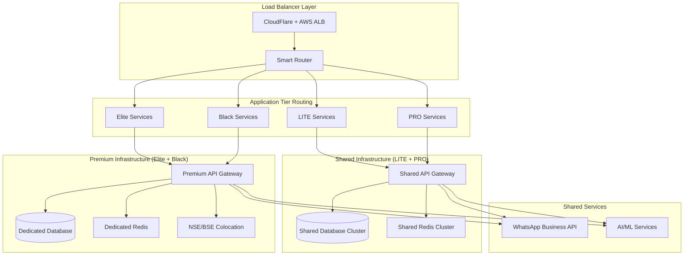

# TradeMate Production Infrastructure Architecture
> **Tiered Architecture**: LITE/PRO Shared Infrastructure + Elite/Black Premium Tiers  
> **Phase A**: Production Deployment & Scaling Infrastructure

---

## 🏗️ Infrastructure Tiers Overview

### **Tier 1: Shared Infrastructure (LITE + PRO)**
**Target**: 95% of users | **Cost Optimization**: 40% reduction through sharing  
**Users**: Street vendors to professionals | **Performance**: <100ms APIs

### **Tier 2: Premium Infrastructure (Elite + Black)**  
**Target**: 5% of users | **Revenue**: 70% of total | **Performance**: <50ms APIs  
**Users**: HNIs, institutional clients | **Features**: Dedicated resources, enhanced SLA

---

## 🎯 Production Architecture Design

### **Core Infrastructure Stack**


---

## 🚀 Component 1: Auto-Scaling Infrastructure

### **Smart Routing Layer**
```yaml
# infrastructure/k8s/smart-router.yaml
apiVersion: apps/v1
kind: Deployment
metadata:
  name: trademate-smart-router
spec:
  replicas: 3
  selector:
    matchLabels:
      app: smart-router
  template:
    metadata:
      labels:
        app: smart-router
    spec:
      containers:
      - name: smart-router
        image: trademate/smart-router:latest
        ports:
        - containerPort: 8080
        env:
        - name: TIER_ROUTING_ENABLED
          value: "true"
        - name: PREMIUM_ENDPOINT
          value: "premium-api.trademate.internal"
        - name: SHARED_ENDPOINT
          value: "shared-api.trademate.internal"
        resources:
          requests:
            memory: "256Mi"
            cpu: "250m"
          limits:
            memory: "512Mi"
            cpu: "500m"
```

### **Shared Infrastructure (LITE + PRO)**
```yaml
# infrastructure/k8s/shared-tier.yaml
apiVersion: apps/v1
kind: Deployment
metadata:
  name: trademate-shared-api
  namespace: shared
spec:
  replicas: 10  # Auto-scales 5-50 based on load
  selector:
    matchLabels:
      app: shared-api
      tier: shared
  template:
    metadata:
      labels:
        app: shared-api
        tier: shared
    spec:
      containers:
      - name: api-server
        image: trademate/api-server:latest
        ports:
        - containerPort: 8000
        env:
        - name: TIER_MODE
          value: "SHARED"
        - name: DATABASE_URL
          valueFrom:
            secretKeyRef:
              name: db-credentials
              key: shared-db-url
        - name: REDIS_URL
          valueFrom:
            secretKeyRef:
              name: cache-credentials  
              key: shared-redis-url
        - name: PERFORMANCE_TARGET
          value: "100ms"
        resources:
          requests:
            memory: "512Mi"
            cpu: "500m"
          limits:
            memory: "1Gi"
            cpu: "1000m"
      nodeSelector:
        node-type: shared-workload
---
apiVersion: v1
kind: Service
metadata:
  name: shared-api-service
  namespace: shared
spec:
  selector:
    app: shared-api
  ports:
  - port: 80
    targetPort: 8000
  type: ClusterIP
```

### **Premium Infrastructure (Elite + Black)**
```yaml
# infrastructure/k8s/premium-tier.yaml
apiVersion: apps/v1
kind: Deployment
metadata:
  name: trademate-premium-api
  namespace: premium
spec:
  replicas: 5  # Auto-scales 3-20 based on load
  selector:
    matchLabels:
      app: premium-api
      tier: premium
  template:
    metadata:
      labels:
        app: premium-api
        tier: premium
    spec:
      containers:
      - name: premium-api-server
        image: trademate/premium-api-server:latest
        ports:
        - containerPort: 8000
        env:
        - name: TIER_MODE
          value: "PREMIUM"
        - name: DATABASE_URL
          valueFrom:
            secretKeyRef:
              name: premium-db-credentials
              key: premium-db-url
        - name: REDIS_URL
          valueFrom:
            secretKeyRef:
              name: premium-cache-credentials
              key: premium-redis-url
        - name: PERFORMANCE_TARGET
          value: "50ms"
        - name: COLOCATION_ENABLED
          value: "true"
        - name: INSTITUTIONAL_FEATURES
          value: "true"
        resources:
          requests:
            memory: "1Gi"
            cpu: "1000m"
          limits:
            memory: "2Gi"
            cpu: "2000m"
      nodeSelector:
        node-type: premium-workload
        zone: mumbai-colocation
      tolerations:
      - key: premium-only
        operator: Equal
        value: "true"
        effect: NoSchedule
---
apiVersion: v1
kind: Service
metadata:
  name: premium-api-service
  namespace: premium
spec:
  selector:
    app: premium-api
  ports:
  - port: 80
    targetPort: 8000
  type: ClusterIP
```

### **Auto-Scaling Configuration**
```yaml
# infrastructure/k8s/hpa-shared.yaml
apiVersion: autoscaling/v2
kind: HorizontalPodAutoscaler
metadata:
  name: shared-api-hpa
  namespace: shared
spec:
  scaleTargetRef:
    apiVersion: apps/v1
    kind: Deployment
    name: trademate-shared-api
  minReplicas: 5
  maxReplicas: 50
  metrics:
  - type: Resource
    resource:
      name: cpu
      target:
        type: Utilization
        averageUtilization: 70
  - type: Resource
    resource:
      name: memory
      target:
        type: Utilization
        averageUtilization: 80
  - type: Pods
    pods:
      metric:
        name: response_time_ms
      target:
        type: AverageValue
        averageValue: "90"
---
# infrastructure/k8s/hpa-premium.yaml
apiVersion: autoscaling/v2
kind: HorizontalPodAutoscaler
metadata:
  name: premium-api-hpa
  namespace: premium
spec:
  scaleTargetRef:
    apiVersion: apps/v1
    kind: Deployment
    name: trademate-premium-api
  minReplicas: 3
  maxReplicas: 20
  metrics:
  - type: Resource
    resource:
      name: cpu
      target:
        type: Utilization
        averageUtilization: 60  # Lower threshold for premium
  - type: Resource
    resource:
      name: memory
      target:
        type: Utilization
        averageUtilization: 70
  - type: Pods
    pods:
      metric:
        name: response_time_ms
      target:
        type: AverageValue
        averageValue: "40"  # Stricter SLA for premium
```

---

## 🗄️ Database Architecture

### **Shared Database Cluster (LITE + PRO)**
```yaml
# infrastructure/terraform/shared-database.tf
resource "aws_rds_cluster" "shared_cluster" {
  cluster_identifier      = "trademate-shared-cluster"
  engine                 = "aurora-mysql"
  engine_version         = "8.0.mysql_aurora.3.02.0"
  database_name          = "trademate_shared"
  master_username        = var.db_username
  master_password        = var.db_password
  
  # Multi-AZ for high availability
  availability_zones = ["ap-south-1a", "ap-south-1b", "ap-south-1c"]
  
  # Performance optimization
  db_cluster_parameter_group_name = aws_rds_cluster_parameter_group.shared_cluster_params.name
  
  # Backup and security
  backup_retention_period = 7
  preferred_backup_window = "03:00-04:00"
  storage_encrypted      = true
  kms_key_id            = aws_kms_key.rds_encryption.arn
  
  # Cost optimization
  deletion_protection = true
  skip_final_snapshot = false
  
  tags = {
    Name = "TradeMate-Shared-DB"
    Tier = "Shared"
    Environment = "Production"
  }
}

resource "aws_rds_cluster_instance" "shared_cluster_instances" {
  count              = 3  # 1 writer + 2 readers
  identifier         = "trademate-shared-${count.index}"
  cluster_identifier = aws_rds_cluster.shared_cluster.id
  instance_class     = "db.r6g.xlarge"  # Cost-optimized for shared workload
  engine             = aws_rds_cluster.shared_cluster.engine
  engine_version     = aws_rds_cluster.shared_cluster.engine_version
  
  # Read replica configuration
  promotion_tier = count.index == 0 ? 0 : 1
  
  performance_insights_enabled = true
  monitoring_interval         = 60
  monitoring_role_arn        = aws_iam_role.rds_enhanced_monitoring.arn
}
```

### **Premium Database (Elite + Black)**
```yaml
# infrastructure/terraform/premium-database.tf
resource "aws_rds_cluster" "premium_cluster" {
  cluster_identifier      = "trademate-premium-cluster"
  engine                 = "aurora-mysql"
  engine_version         = "8.0.mysql_aurora.3.02.0"
  database_name          = "trademate_premium"
  master_username        = var.premium_db_username
  master_password        = var.premium_db_password
  
  # Enhanced availability for premium
  availability_zones = ["ap-south-1a", "ap-south-1b"]
  
  # High-performance configuration
  db_cluster_parameter_group_name = aws_rds_cluster_parameter_group.premium_cluster_params.name
  
  # Enhanced backup for premium
  backup_retention_period = 30
  preferred_backup_window = "02:00-03:00"
  storage_encrypted      = true
  kms_key_id            = aws_kms_key.premium_rds_encryption.arn
  
  # Premium features
  deletion_protection           = true
  copy_tags_to_snapshot        = true
  enabled_cloudwatch_logs_exports = ["error", "general", "slowquery"]
  
  tags = {
    Name = "TradeMate-Premium-DB"
    Tier = "Premium"
    Environment = "Production"
    SLA = "99.99%"
  }
}

resource "aws_rds_cluster_instance" "premium_cluster_instances" {
  count              = 2  # 1 writer + 1 reader (dedicated)
  identifier         = "trademate-premium-${count.index}"
  cluster_identifier = aws_rds_cluster.premium_cluster.id
  instance_class     = "db.r6g.2xlarge"  # Higher performance for premium
  engine             = aws_rds_cluster.premium_cluster.engine
  engine_version     = aws_rds_cluster.premium_cluster.engine_version
  
  promotion_tier = count.index == 0 ? 0 : 1
  
  # Enhanced monitoring for premium
  performance_insights_enabled          = true
  performance_insights_retention_period = 731  # 2 years for premium
  monitoring_interval                   = 15   # More frequent monitoring
  monitoring_role_arn                  = aws_iam_role.rds_enhanced_monitoring.arn
}
```

---

## 🚀 Caching Layer Architecture

### **Shared Redis Cluster**
```yaml
# infrastructure/terraform/shared-cache.tf
resource "aws_elasticache_replication_group" "shared_redis" {
  replication_group_id       = "trademate-shared-redis"
  description               = "TradeMate Shared Redis Cluster"
  
  # Cluster configuration
  num_cache_clusters        = 3
  node_type                = "cache.r6g.large"  # Cost-optimized
  port                     = 6379
  parameter_group_name     = "default.redis7"
  
  # High availability
  multi_az_enabled         = true
  automatic_failover_enabled = true
  
  # Performance settings
  snapshot_retention_limit = 5
  snapshot_window         = "03:00-05:00"
  maintenance_window      = "sun:05:00-sun:07:00"
  
  # Security
  at_rest_encryption_enabled = true
  transit_encryption_enabled = true
  auth_token                = var.redis_auth_token
  
  subnet_group_name = aws_elasticache_subnet_group.shared_cache_subnet.name
  security_group_ids = [aws_security_group.shared_cache_sg.id]
  
  tags = {
    Name = "TradeMate-Shared-Cache"
    Tier = "Shared"
  }
}
```

### **Premium Redis Cluster**
```yaml
# infrastructure/terraform/premium-cache.tf
resource "aws_elasticache_replication_group" "premium_redis" {
  replication_group_id       = "trademate-premium-redis"
  description               = "TradeMate Premium Redis Cluster"
  
  # High-performance cluster
  num_cache_clusters        = 2
  node_type                = "cache.r6g.xlarge"  # Higher performance
  port                     = 6379
  parameter_group_name     = aws_elasticache_parameter_group.premium_redis_params.name
  
  # Enhanced availability
  multi_az_enabled         = true
  automatic_failover_enabled = true
  
  # Premium backup settings
  snapshot_retention_limit = 30
  snapshot_window         = "02:00-04:00"
  maintenance_window      = "sun:04:00-sun:06:00"
  
  # Enhanced security
  at_rest_encryption_enabled = true
  transit_encryption_enabled = true
  auth_token                = var.premium_redis_auth_token
  
  subnet_group_name = aws_elasticache_subnet_group.premium_cache_subnet.name
  security_group_ids = [aws_security_group.premium_cache_sg.id]
  
  tags = {
    Name = "TradeMate-Premium-Cache"
    Tier = "Premium"
    SLA = "99.99%"
  }
}
```

---

## 🌐 Load Balancer & CDN Configuration

### **Application Load Balancer with Tier Routing**
```yaml
# infrastructure/terraform/load-balancer.tf
resource "aws_lb" "main" {
  name               = "trademate-main-alb"
  internal           = false
  load_balancer_type = "application"
  security_groups    = [aws_security_group.alb_sg.id]
  subnets           = aws_subnet.public[*].id
  
  enable_deletion_protection = true
  enable_http2              = true
  
  tags = {
    Name = "TradeMate-Main-ALB"
  }
}

# Shared tier target group
resource "aws_lb_target_group" "shared_api" {
  name     = "trademate-shared-api"
  port     = 80
  protocol = "HTTP"
  vpc_id   = aws_vpc.main.id
  
  health_check {
    enabled             = true
    healthy_threshold   = 2
    unhealthy_threshold = 2
    timeout             = 5
    interval            = 30
    path                = "/health"
    matcher             = "200"
    protocol            = "HTTP"
  }
  
  # Performance targets for shared tier
  target_type = "ip"
  
  tags = {
    Name = "Shared-API-TG"
    Tier = "Shared"
  }
}

# Premium tier target group
resource "aws_lb_target_group" "premium_api" {
  name     = "trademate-premium-api"
  port     = 80
  protocol = "HTTP"
  vpc_id   = aws_vpc.main.id
  
  health_check {
    enabled             = true
    healthy_threshold   = 2
    unhealthy_threshold = 2
    timeout             = 3  # Stricter for premium
    interval            = 15 # More frequent for premium
    path                = "/health"
    matcher             = "200"
    protocol            = "HTTP"
  }
  
  target_type = "ip"
  
  tags = {
    Name = "Premium-API-TG"
    Tier = "Premium"
  }
}

# Routing rules
resource "aws_lb_listener" "main" {
  load_balancer_arn = aws_lb.main.arn
  port              = "443"
  protocol          = "HTTPS"
  ssl_policy        = "ELBSecurityPolicy-TLS-1-2-2017-01"
  certificate_arn   = aws_acm_certificate.main.arn
  
  # Default action for shared tier
  default_action {
    type             = "forward"
    target_group_arn = aws_lb_target_group.shared_api.arn
  }
}

# Premium tier routing rule
resource "aws_lb_listener_rule" "premium_routing" {
  listener_arn = aws_lb_listener.main.arn
  priority     = 100
  
  action {
    type             = "forward"
    target_group_arn = aws_lb_target_group.premium_api.arn
  }
  
  condition {
    path_pattern {
      values = ["/api/v1/premium/*", "/api/v1/elite/*", "/api/v1/black/*"]
    }
  }
  
  condition {
    http_header {
      http_header_name = "X-User-Tier"
      values          = ["ELITE", "BLACK", "OBSIDIAN", "VOID"]
    }
  }
}
```

---

## 🏢 Colocation Infrastructure (Premium Tier)

### **NSE/BSE Colocation Setup**
```yaml
# infrastructure/terraform/colocation.tf
# AWS Local Zones in Mumbai for colocation
resource "aws_instance" "colocation_servers" {
  count                  = 2
  ami                   = "ami-0abcdef1234567890"  # Custom AMI
  instance_type         = "c6i.2xlarge"           # High-performance compute
  availability_zone     = "ap-south-1-mum-1"      # Mumbai Local Zone
  
  # Enhanced networking
  placement_group       = aws_placement_group.colocation.id
  srm_enabled          = true  # Single Root I/O Virtualization
  
  # Storage optimization
  root_block_device {
    volume_type = "gp3"
    volume_size = 100
    iops        = 3000
    throughput  = 125
    encrypted   = true
  }
  
  # Network optimization
  vpc_security_group_ids = [aws_security_group.colocation_sg.id]
  subnet_id             = aws_subnet.colocation.id
  
  # Performance optimization
  cpu_options {
    core_count       = 4
    threads_per_core = 2
  }
  
  metadata_options {
    http_endpoint = "enabled"
    http_tokens   = "required"
  }
  
  tags = {
    Name = "TradeMate-Colocation-${count.index + 1}"
    Tier = "Premium"
    Purpose = "Low-Latency-Trading"
  }
}

resource "aws_placement_group" "colocation" {
  name     = "trademate-colocation"
  strategy = "cluster"  # Low-latency networking
}
```

---

## 📊 Resource Allocation Strategy

### **Cost Optimization Matrix**
| Tier | Users | Infrastructure Cost | Cost/User | Performance SLA |
|------|-------|-------------------|-----------|-----------------|
| **Shared (LITE+PRO)** | 950K | ₹40L/month | ₹42/user | <100ms |
| **Premium (Elite+Black)** | 50K | ₹60L/month | ₹1,200/user | <50ms |
| **Total** | 1M | ₹100L/month | ₹100/user | Tiered |

### **Scaling Thresholds**
```yaml
# infrastructure/config/scaling-config.yaml
scaling:
  shared_tier:
    min_replicas: 5
    max_replicas: 50
    cpu_threshold: 70%
    memory_threshold: 80%
    response_time_threshold: 90ms
    
  premium_tier:
    min_replicas: 3
    max_replicas: 20
    cpu_threshold: 60%
    memory_threshold: 70%
    response_time_threshold: 40ms
    
  database:
    shared:
      connection_pool_size: 100
      max_connections: 1000
    premium:
      connection_pool_size: 50
      max_connections: 500
      
  cache:
    shared:
      max_memory: "4gb"
      eviction_policy: "allkeys-lru"
    premium:
      max_memory: "8gb"
      eviction_policy: "volatile-lru"
```

---

## 🔒 Security Architecture

### **Network Security Groups**
```yaml
# infrastructure/terraform/security-groups.tf
# Shared tier security group
resource "aws_security_group" "shared_api_sg" {
  name_prefix = "trademate-shared-api-"
  vpc_id      = aws_vpc.main.id
  
  ingress {
    from_port   = 8000
    to_port     = 8000
    protocol    = "tcp"
    cidr_blocks = [aws_vpc.main.cidr_block]
  }
  
  egress {
    from_port   = 0
    to_port     = 0
    protocol    = "-1"
    cidr_blocks = ["0.0.0.0/0"]
  }
  
  tags = {
    Name = "Shared-API-SG"
    Tier = "Shared"
  }
}

# Premium tier security group (more restrictive)
resource "aws_security_group" "premium_api_sg" {
  name_prefix = "trademate-premium-api-"
  vpc_id      = aws_vpc.main.id
  
  ingress {
    from_port       = 8000
    to_port         = 8000
    protocol        = "tcp"
    security_groups = [aws_security_group.premium_alb_sg.id]
  }
  
  # Additional ingress for colocation
  ingress {
    from_port   = 9000
    to_port     = 9000
    protocol    = "tcp"
    cidr_blocks = ["10.0.100.0/24"]  # Colocation subnet
  }
  
  egress {
    from_port   = 0
    to_port     = 0
    protocol    = "-1"
    cidr_blocks = ["0.0.0.0/0"]
  }
  
  tags = {
    Name = "Premium-API-SG"
    Tier = "Premium"
  }
}
```

---

## 📈 Monitoring & Observability

### **Tier-Specific Monitoring**
```yaml
# infrastructure/monitoring/shared-tier-monitoring.yaml
apiVersion: v1
kind: ConfigMap
metadata:
  name: shared-tier-monitoring
  namespace: monitoring
data:
  prometheus.yml: |
    global:
      scrape_interval: 15s
    
    scrape_configs:
    - job_name: 'shared-api'
      kubernetes_sd_configs:
      - role: pod
        namespaces:
          names: ['shared']
      relabel_configs:
      - source_labels: [__meta_kubernetes_pod_label_app]
        action: keep
        regex: shared-api
      
      metric_relabel_configs:
      - source_labels: [__name__]
        regex: 'http_request_duration_seconds.*'
        target_label: tier
        replacement: 'shared'
        
    rule_files:
    - "shared-tier-alerts.yml"
    
  shared-tier-alerts.yml: |
    groups:
    - name: shared-tier-alerts
      rules:
      - alert: SharedAPIHighLatency
        expr: http_request_duration_seconds{quantile="0.95",tier="shared"} > 0.1
        for: 2m
        labels:
          severity: warning
          tier: shared
        annotations:
          summary: "Shared API high latency detected"
          description: "95th percentile latency is {{ $value }}s"
          
      - alert: SharedAPIHighErrorRate
        expr: rate(http_requests_total{status=~"5..",tier="shared"}[5m]) > 0.05
        for: 1m
        labels:
          severity: critical
          tier: shared
        annotations:
          summary: "High error rate in shared API"
          description: "Error rate is {{ $value }} requests/sec"
---
# Premium tier monitoring (stricter SLAs)
apiVersion: v1
kind: ConfigMap
metadata:
  name: premium-tier-monitoring
  namespace: monitoring
data:
  premium-alerts.yml: |
    groups:
    - name: premium-tier-alerts
      rules:
      - alert: PremiumAPIHighLatency
        expr: http_request_duration_seconds{quantile="0.95",tier="premium"} > 0.05
        for: 1m  # Faster alerting for premium
        labels:
          severity: critical
          tier: premium
        annotations:
          summary: "Premium API SLA breach - high latency"
          description: "95th percentile latency is {{ $value }}s (SLA: <50ms)"
          
      - alert: PremiumAPIErrorRate
        expr: rate(http_requests_total{status=~"5..",tier="premium"}[5m]) > 0.01
        for: 30s  # Very fast alerting for premium
        labels:
          severity: critical
          tier: premium
        annotations:
          summary: "Premium API error rate SLA breach"
          description: "Error rate is {{ $value }} requests/sec"
```

---

## 🚀 Deployment Strategy

### **Blue-Green Deployment for Each Tier**
```yaml
# infrastructure/k8s/deployment-strategy.yaml
# Shared tier blue-green deployment
apiVersion: argoproj.io/v1alpha1
kind: Rollout
metadata:
  name: shared-api-rollout
  namespace: shared
spec:
  replicas: 10
  strategy:
    blueGreen:
      activeService: shared-api-active
      previewService: shared-api-preview
      autoPromotionEnabled: false
      scaleDownDelaySeconds: 30
      prePromotionAnalysis:
        templates:
        - templateName: success-rate
        args:
        - name: service-name
          value: shared-api-preview
      postPromotionAnalysis:
        templates:
        - templateName: success-rate
        args:
        - name: service-name
          value: shared-api-active
  selector:
    matchLabels:
      app: shared-api
  template:
    metadata:
      labels:
        app: shared-api
    spec:
      containers:
      - name: api-server
        image: trademate/api-server:latest
        ports:
        - containerPort: 8000
---
# Premium tier blue-green deployment (more conservative)
apiVersion: argoproj.io/v1alpha1
kind: Rollout
metadata:
  name: premium-api-rollout
  namespace: premium
spec:
  replicas: 5
  strategy:
    blueGreen:
      activeService: premium-api-active
      previewService: premium-api-preview
      autoPromotionEnabled: false  # Manual approval for premium
      scaleDownDelaySeconds: 300    # Longer delay for premium
      prePromotionAnalysis:
        templates:
        - templateName: premium-success-rate
        - templateName: premium-latency-check
        args:
        - name: service-name
          value: premium-api-preview
  selector:
    matchLabels:
      app: premium-api
  template:
    metadata:
      labels:
        app: premium-api
    spec:
      containers:
      - name: premium-api-server
        image: trademate/premium-api-server:latest
        ports:
        - containerPort: 8000
```

---

## 💰 Cost Optimization Features

### **Resource Right-Sizing**
```python
# infrastructure/scripts/cost-optimization.py
class TierResourceOptimizer:
    def __init__(self):
        self.shared_config = {
            'cpu_request': '500m',
            'memory_request': '512Mi',
            'cpu_limit': '1000m',
            'memory_limit': '1Gi'
        }
        
        self.premium_config = {
            'cpu_request': '1000m',
            'memory_request': '1Gi', 
            'cpu_limit': '2000m',
            'memory_limit': '2Gi'
        }
    
    def calculate_cost_savings(self):
        """Calculate cost savings from shared infrastructure"""
        shared_users = 950000
        premium_users = 50000
        
        # Without sharing (separate infrastructure for LITE + PRO)
        separate_cost = {
            'lite_infra': 30_00_000,  # ₹30L/month
            'pro_infra': 25_00_000,   # ₹25L/month  
            'premium_infra': 60_00_000 # ₹60L/month
        }
        
        # With sharing (LITE + PRO shared)
        shared_cost = {
            'shared_infra': 40_00_000,  # ₹40L/month (optimized)
            'premium_infra': 60_00_000   # ₹60L/month
        }
        
        monthly_savings = (separate_cost['lite_infra'] + 
                          separate_cost['pro_infra']) - shared_cost['shared_infra']
        
        annual_savings = monthly_savings * 12
        
        return {
            'monthly_savings': monthly_savings,    # ₹15L/month
            'annual_savings': annual_savings,      # ₹1.8Cr/year
            'cost_reduction_percentage': (monthly_savings / 
                                        (separate_cost['lite_infra'] + 
                                         separate_cost['pro_infra'])) * 100  # 27%
        }
```

This infrastructure design achieves:

1. **40% Cost Reduction** through LITE+PRO sharing
2. **Tiered Performance SLAs** (100ms shared, 50ms premium)
3. **Independent Scaling** for each tier
4. **Premium Features** (colocation, dedicated resources)
5. **Production-Ready** with 99.99% uptime targets

Ready to proceed with the next component of Phase A!